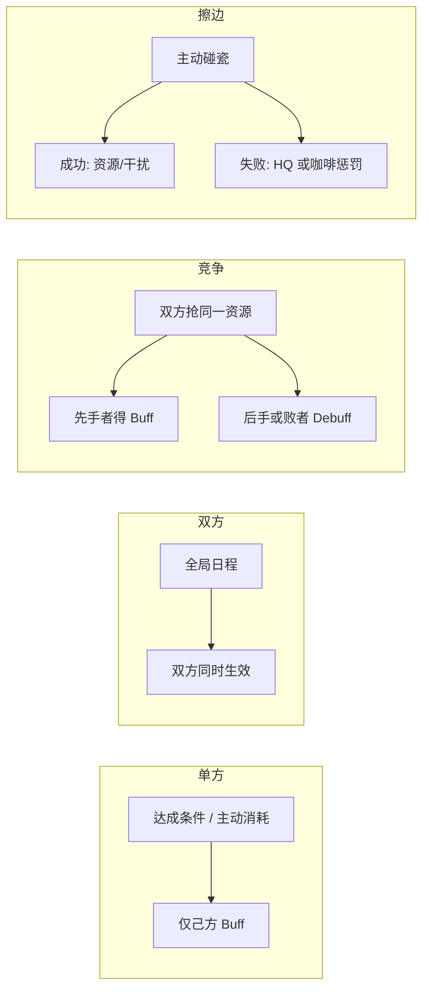
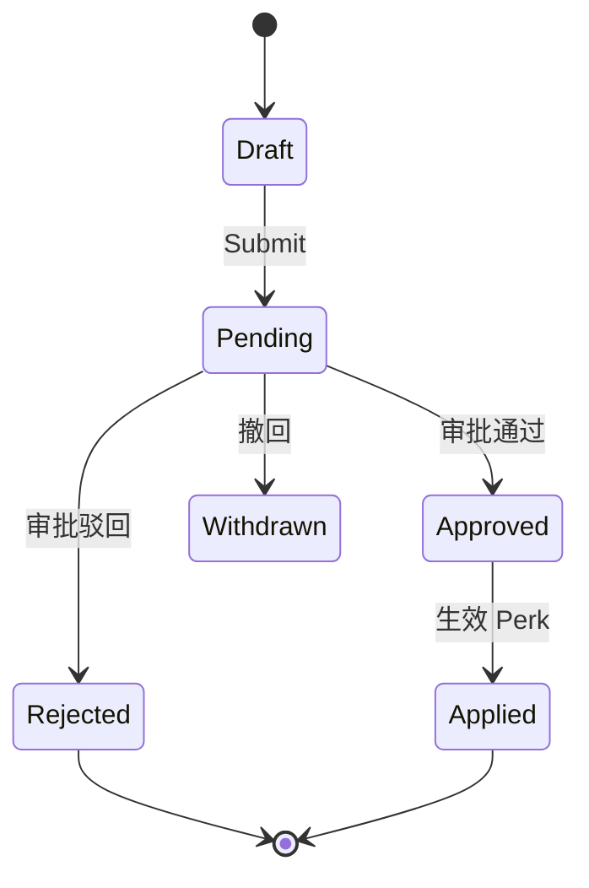
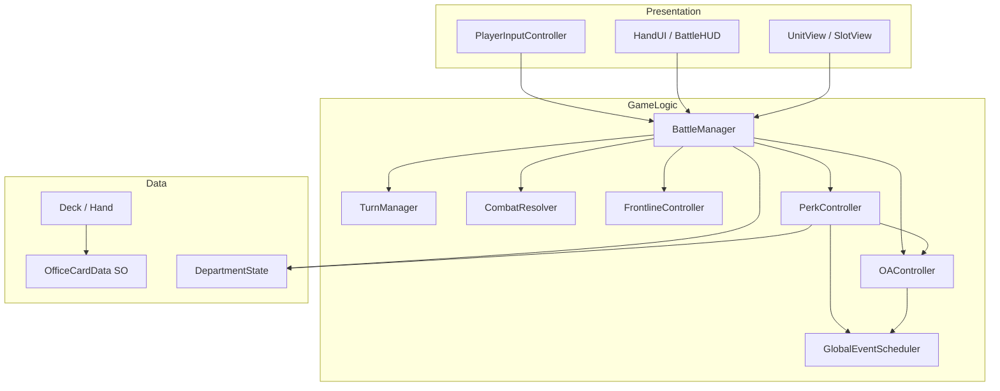

# 🎮 游戏项目独立开发策划书：《疯狂周一：办公室战争》

> **技术栈：** C# + Unity 2022 LTS（或 6000.x）  
> **项目定位：** 🎓 **学习用** — 跟 [`教案.md`](教案.md) 分 20 课实现；源码骨架 + 注释引导，参考答案在 `Reference/`  
> **开发策略：** 每课实现后 Play / 自测；课 17 完成后 Demo 可玩  
> **版本控制：** Git + `.gitignore`（忽略 `Library/`、`Temp/`、`Logs/`）

### 学习路径

| 文档 | 用途 |
|---|---|
| **[`教案.md`](教案.md)** | **主教程**（课 01~20，按序跟做） |
| [`plan.md`](plan.md) | 游戏规则、福利、OA 策划 |
| `Reference/` | 课 17 前的完整 Demo 答案（卡关再看，在 Assets 外） |
| 脚本内 `课 XX` / `LEARN:` | 当课提示 |

---

## 一、 项目基本信息

| 项 | 内容 |
|---|---|
| **暂定名** | 《疯狂周一：办公室战争》（Crazy Monday: Office War） |
| **类型** | 2D / 2.5D 单机策略卡牌（CCG / Roguelike 构筑） |
| **致敬标杆** | 《Kards》（空间阵线）、《炉石传说》（资源成长） |
| **美术风格** | 幽默简笔画 / 职场表情包 / 扁平化大厂 UI |
| **目标平台** | PC（Windows / macOS），分辨率 1920×1080 |

---

## 二、 核心世界观与胜负判定

**剧情背景：** 某大厂年终盘点将至，**产品经理部** 与 **研发程序员部** 为争夺唯一 S 级年终奖，在「中央茶水间」展开甩锅、画饼、PPT 轰炸对决。

**战场布局（三行，类似 Kards）：**

```
[ 敌方后方：敌方主管办公室 (HQ) ]     ← 敌方部署区 + HQ 血量
────────────────────────────────
[      中央阵线：老板的视线区      ]     ← 前线，同一时间仅一方占领
────────────────────────────────
[ 己方后方：己方主管办公室 (HQ) ]     ← 己方部署区 + HQ 血量
```

**胜负判定：**
- 各部门 HQ 初始「部门预算」= 20（等同 HQ 血量）
- 将员工推至前线，对敌方 HQ 发起「汇报/甩锅」（攻击）
- 先将对方部门预算削减至 **0** 的一方获胜

---

## 三、 核心战斗机制

### 1. 双重咖啡资源（Coffee System）

| 概念 | 规则 |
|---|---|
| **咖啡上限** | 开局 1，每回合开始 +1（上限 12）；回合开始时当前可用咖啡回满 |
| **入职成本（Hire Cost）** | 打出员工卡到己方后方，一次性扣咖啡 |
| **沟通成本（Action Cost）** | 推进到前线或攻击时，额外扣该员工行动费；咖啡不足则「摸鱼」 |

### 2. 前线争夺（Frontline）

- 前线同一时间只能被一方占领（有单位即占领，双方都有则按规则结算，见下文）
- 己方占领前线时，后方远程单位（Manager）可安全输出
- 敌方占领前线时，己方后方 HQ 可被敌方前线近战直接攻击

### 3. 兵种与 JobType

| JobType | Kards 对应 | 职场设定 | 代码特性 |
|---|---|---|---|
| `Intern` | 步兵 | 实习生、外包 | 部署费低，占线挡枪 |
| `Engineer` | 坦克 | 架构师、全栈 | 血厚攻高，行动费高 |
| `Manager` | 火炮 | PPT 战神 | 在后方攻击时不受反击 |
| `HR` | 支援 | 招聘、行政 | 不可推进，可回血/加攻 |

### 4. 战斗细则（需在代码中明确实现）

```
部署：手牌 → 己方后方空位，扣 Hire Cost
推进：后方单位 → 前线（需空位或替换规则），扣 Action Cost，标记 HasActed
攻击：前线单位 → 相邻敌方单位或 HQ，双方互扣 KPI（Manager 在后方攻击免反击）
死亡：精神值 ≤ 0 → 从战场移除，释放格子
回合结束：重置 HasActed，咖啡回满，切换 ActivePlayer，咖啡上限 +1（若未达 12）
```

**前线冲突（建议 MVP 规则）：** 若双方同时有单位想占前线，先到达者占线；同回合对撞时按 KPI 互扣，存活者占线。

### 5. 公司福利系统（Perk System）— 下一阶段重点

在咖啡 / HQ / 卡牌之外，增加 **「部门福利」** 层，用职场梗包装单方与双方奖励。

#### 5.1 三类福利

| 类型 | 含义 | 示例 |
|---|---|---|
| **单方福利** | 本部门正当好处，仅己方生效 | 下午茶、团建、弹性办公 |
| **双方福利** | 公司 HR 统一通知，影响双方 | 全员培训、行政发奶茶 |
| **竞争福利** | 一方得手、另一方吃亏 | 抢订下午茶、**抢零食** |
| **擦边福利** | 单方冒险，成功血赚、失败翻车 | **偷前台东西** |



#### 5.2 福利清单（策划）

**单方福利**

| ID | 名称 | 触发 | 效果 |
|---|---|---|---|
| `tea_break` | 下午茶 | 主动：花 2 咖啡 | 本回合所有单位沟通费 -1 |
| `tea_break_passive` | 行政送奶茶 | 每 3 回合自动 | 抽 1 张牌 |
| `team_building` | 团建 | 连续占前线 2 回合 | 全体友军精神值 +2，本局上限 +1 |
| `flex_work` | 弹性办公 | 本局首次部署 | 第一张员工卡入职费 -1 |
| `late_night_snack` | 夜宵报销 | 本回合击杀敌方单位 | 下回合额外 +1 咖啡 |

**竞争福利**

| ID | 名称 | 触发 | 效果 |
|---|---|---|---|
| `tea_rush` | 抢订下午茶 | 双方均可抢（竞争） | 先花 3 咖啡者拿 Buff；另一方本回合 -1 咖啡 |
| `snack_rush` | 抢零食 | 第 3、7、11 回合开放抢答 | 先花 1 咖啡者抽 1 牌并 +1 咖啡；另一方「被行政记名」：下回合少抽 1 牌 |
| `snack_rush_tie` | （平局规则） | 同回合双方同时抢 | 均不得利；双方各 -1 咖啡（行政收走零食柜） |

**擦边福利**

| ID | 名称 | 触发 | 效果 |
|---|---|---|---|
| `steal_reception` | 偷前台东西 | 主动：0 咖啡，3 回合冷却 | **成功**（基础 60%）：+2 咖啡或敌方 HQ -1（顺走签到簿） |
| | | | **失败**（40%）：己方 HQ -2，日志「前台监控已记录」 |
| `steal_reception_risk` | （风险修正） | 敌方占前线时 | 成功率 -20%（前台有人盯着） |
| `steal_reception_crit` | （大成功） | 10% 概率 | 额外抽 1 张牌，文案「顺手牵羊还摸到了加班券」 |

**双方福利**

| ID | 名称 | 触发 | 效果 |
|---|---|---|---|
| `company_training` | 全员培训 | 第 5、9 回合 | 双方咖啡上限 +1 |
| `hr_milk_tea` | 行政发奶茶 | 随机回合（HQ 均 > 10） | 双方 HQ 各 +3 |
| `cross_dept_outing` | 跨部门团建 | 双方 HQ 均 > 10 | 双方各抽 1 牌；下回合双方不可攻击 HQ |

#### 5.3 与现有系统的挂钩点

| 时机 | 检查 / 结算 |
|---|---|
| `BeginTurn` | 回合类福利、全局日程、`GlobalEventScheduler` |
| `TryPlayCardFromHand` | 弹性办公、入职费减免 |
| `TryAdvanceUnit` / `TryAttack` | 下午茶沟通费减免 |
| 占线状态变化 | 团建连占线计数；偷前台成功率修正（敌方占线 -20%） |
| 单位击杀 | 夜宵报销 |
| 全局回合 | `snack_rush` 开放窗口（3/7/11 回合） |
| UI 按钮 | `TryActivatePerk(TeaBreak / SnackRush / StealReception)` |
| 竞争结算 | `PerkController.ResolveCompetitivePerk`：比谁先激活、同回合平局 |
| 随机判定 | `StealReception` 成功/失败/大成功 |
| OA 提交 | `OAController.TrySubmit` → Pending；占行政带宽 |
| OA 结算 | `BeginTurn` → `TickApprovals` → `OnOAApproved` → 激活 Perk |

### 6. OA 审批系统（Office Automation）— 与福利联动

把 **「走 OA」** 做成独立玩法层：**福利不是点了就生效，多数要先提单、等审批**（和真实大厂一致）。  
「偷前台」等擦边行为可 **不走 OA** 或 **走假单据**，形成正当流程 vs 野路子 的对比。

#### 6.1 设计目标

| 目标 | 说明 |
|---|---|
| **沉浸感** | 团建、下午茶、零食领用 = 填单 → 审批 → 到账 |
| **策略深度** | 审批耗时、加急、预算池、驳回风险 |
| **与战斗耦合** | 审批中占用「行政带宽」；通过单据强化 Perk |
| **可扩展** | 抽象 `IOABackend`，后期可对接真实 OA（飞书/钉钉/自研） |

#### 6.2 OA 单据类型（Form → 游戏效果）

| FormType | 单据名称 | 关联 Perk | 审批链 | 通过后效果 |
|---|---|---|---|---|
| `TeaBreakApply` | 下午茶申请单 | `tea_break` | 直属主管 | 本回合沟通费 -1 |
| `TeamBuildingApply` | 团建活动申请 | `team_building` | 主管 → HR | 全体友军 +2 精神值 |
| `SnackRequisition` | 零食领用单 | `snack_rush` | 行政（先到先得） | 抽 1 牌 +1 咖啡 |
| `TrainingBudget` | 培训预算单 | `company_training` | HR（系统单） | 双方咖啡上限 +1 |
| `ExpenseReport` | 夜宵报销单 | `late_night_snack` | 主管 → 财务 | 下回合 +1 咖啡 |
| `SupplyRequest` | 办公物资申领 | （掩护） | 前台 | 成功则 +1 咖啡；**偷前台**可伪造此单 |
| `UrgentStamp` | 加急审批单 | 元操作 | 总监 | 任意在审单据 **本回合立刻下结论** |

**不走 OA（即时生效 / 非法）**

| 行为 | 说明 |
|---|---|
| `steal_reception` | 不提交单据直接行动；或提交 `SupplyRequest` 伪装（驳回率更高） |
| `tea_rush` 抢订 | 走竞争逻辑，可同时弹「行政：今日下午茶额度已抢光」 |

#### 6.3 审批状态机



| 状态 | 玩家可见 | 规则 |
|---|---|---|
| `Draft` | 表单草稿 | 可改备注，未占带宽 |
| `Pending` | 审批中 | 占用 1 点「行政带宽」；默认 **下回合开始** 出结果 |
| `Approved` | 已通过 | 立即或下回合初触发 Perk |
| `Rejected` | 已驳回 | 扣 1 咖啡或 HQ -1；日志「主管：理由不充分」 |
| `Withdrawn` | 已撤回 | 返还半额咖啡（若已付） |

#### 6.4 核心规则

**行政带宽（Admin Capacity）**
- 每部门每回合最多 **2 张在审单据**（可配置）
- 超出则提示「行政系统繁忙，请先处理待办」

**公司福利预算池（Welfare Budget Pool）**
- 全局共享，初始 10 点；团建/下午茶/零食各消耗 1~3 点
- 预算不足 → 单据 **自动驳回** 或转入「排队下一回合」
- 双方竞争：同一回合都申请团建 → 先提交者占预算

**审批耗时**
- 默认：**提交后下一回合己方 `BeginTurn` 时结算**
- **加急单（`UrgentStamp`）**：花 2 咖啡，本回合 `EndTurn` 前出结果
- 敌方占前线：己方审批 **延迟 +1 回合**（「主管在开会」）

**审批人（Approver）— MVP 用规则模拟，不对接真人**

| 角色 | 通过倾向 | 特殊规则 |
|---|---|---|
| 直属主管 | 70% | 己方 HQ > 15 时 +10% |
| HR | 60% | 团建/培训类 +15% |
| 行政 | 先到先得 | 零食类仅 1 份/窗口 |
| 前台 | 40% | `SupplyRequest` 伪装偷前台时 -20% |

#### 6.5 与 Perk 的调用关系

```
玩家点「下午茶」
    ↓
PerkController 检查：该 Perk 是否 requiresOA？
    ↓ 是
OAController.Submit(TeaBreakApply) → Pending
    ↓ 下回合 BeginTurn
OAController.TickApprovals() → Approved
    ↓
PerkController.Activate(TeaBreak)
    ↓
BattleManager 正常结算 Buff
```

**快捷通道（Demo 可选）**
- 战斗教程前 2 回合：下午茶 **免审批**（新手保护）
- 设置里「打工人模式」：全部福利免 OA（纯战斗测试）

#### 6.6 对接「现有 OA 系统」的扩展口

若你司有真实 OA（自研 / 飞书 / 钉钉），用适配器接入，**游戏内仍走同一套 `OARequest` 模型**：

```csharp
public interface IOABackend
{
    Task<string> SubmitAsync(OARequest request);   // 返回外部单号
    Task<OARequestStatus> PollAsync(string externalId);
    Task<bool> WithdrawAsync(string externalId);
}

// MVP
public sealed class LocalSimOABackend : IOABackend { /* 规则表模拟 */ }

// 后期
public sealed class HttpOABackend : IOABackend { /* REST Webhook */ }
public sealed class FeishuOaAdapter : IOABackend { /* 飞书审批实例 */ }
```

**映射表（策划维护 CSV / SO）**

| 游戏 FormType | 外部流程 template_id | 备注 |
|---|---|---|
| `TeaBreakApply` | （填你司真实模板 ID） | |
| `TeamBuildingApply` | | |
| `SnackRequisition` | | |

> 你提供现有 OA 的 **单据类型列表 + 审批节点** 后，把上表补全即可 1:1 还原。

#### 6.7 UI 入口（战斗场景内）

| UI | 内容 |
|---|---|
| **OA 待办角标** | 审批中 N 条；驳回红点 |
| **OA 面板** | 列表：单号 / 类型 / 状态 / 预计生效回合 |
| **发起申请** | 从 Perk 按钮跳转预填表单，或独立「+ 新建申请」 |
| **加急** | 对已 Pending 单据点「找总监加急」 |

---

## 四、 Unity 工程结构

### 4.1 推荐目录

```
Assets/
├── _Project/
│   ├── Scenes/
│   │   ├── Boot.unity              # 初始化、加载配置
│   │   └── Battle.unity            # 主战斗场景
│   ├── Scripts/
│   │   ├── Core/                   # 枚举、常量、事件总线
│   │   ├── Data/                   # ScriptableObject 定义
│   │   ├── Cards/                  # 卡牌实例、卡组、手牌
│   │   ├── Battlefield/            # 格子、前线、单位实体
│   │   ├── Combat/                 # 伤害、攻击、死亡
│   │   ├── Resources/              # 咖啡、HQ 血量
│   │   ├── Perks/                  # 福利定义、触发、全局事件
│   │   ├── OA/                     # 审批单据、流程、Backend 适配
│   │   ├── Turn/                   # 回合状态机
│   │   ├── Input/                  # 点击、拖拽、选中
│   │   ├── AI/                     # 简单敌方 AI
│   │   ├── Demo/                   # BattleDemoBootstrap
│   │   └── UI/                     # HandUI、BattleHUD、PerkHUD、OAPanel
│   ├── ScriptableObjects/
│   │   └── Cards/                  # 各卡牌 .asset 配置
│   ├── Prefabs/
│   │   ├── CardView.prefab
│   │   ├── UnitView.prefab         # 先用 Cube + TextMeshPro
│   │   └── SlotView.prefab         # 格子高亮
│   ├── Art/                        # 后期：贴图、Spine 等
│   └── Audio/
├── Plugins/                        # 第三方（如 DOTween，可选）
└── Settings/                       # URP/Input System 等
```

### 4.2 核心依赖（Package Manager）

| 包 | 用途 |
|---|---|
| **TextMeshPro** | 卡牌名、数值、HQ 血量显示 |
| **Input System**（可选） | 统一鼠标/触控 |
| **Unity UI (uGUI)** | 手牌、按钮、HUD |
| **2D Sprite** 或 **URP** | 2D 正交相机或轻量 3D |

**MVP 阶段不必引入：** Addressables、Netcode、Timeline。

---

## 五、 C# 架构设计

### 5.1 分层关系



**原则：**
- **数据（SO + 运行时 State）** 与 **表现（MonoBehaviour View）** 分离
- `BattleManager` 作为单场战斗的 Facade，不直接在 View 里写扣血逻辑
- 用 **C# event** 或 **ScriptableObject Event Channel** 通知 UI 刷新

### 5.2 核心类型一览

#### 枚举与常量 — `Core/GameEnums.cs`

```csharp
public enum JobType { Intern, Engineer, Manager, HR }
public enum Faction { Player, Enemy }
public enum BoardRow { PlayerBack, Frontline, EnemyBack }
public enum TurnPhase { Draw, Main, End }
public enum GameResult { Ongoing, PlayerWin, EnemyWin }
public enum PerkType {
    TeaBreak, TeamBuilding, FlexWork,
    CompanyTraining, TeaRush,
    SnackRush, StealReception  /* ... */
}
public enum PerkScope { Self, Both, Competitive, Risky }
public enum PerkTrigger { Manual, OnTurnStart, OnFrontlineHold, GlobalSchedule, OnKill, GlobalRoundWindow, OnOAApproved }
public enum OAFormType { TeaBreakApply, TeamBuildingApply, SnackRequisition, TrainingBudget, ExpenseReport, SupplyRequest, UrgentStamp }
public enum OARequestStatus { Draft, Pending, Approved, Rejected, Withdrawn, Applied }
```

#### 卡牌配置 — `Data/OfficeCardData.cs`（ScriptableObject）✅ 已有概念

```csharp
[CreateAssetMenu(menuName = "OfficeWar/Card")]
public class OfficeCardData : ScriptableObject
{
    public string cardId;
    public string displayName;
    public JobType job;
    public int hireCost;
    public int actionCost;
    public int maxMorale;      // 精神值 / HP
    public int kpi;            // 攻击力
    public Sprite icon;        // 后期
    public bool canAdvance = true;
    public bool isSupport;     // HR 等
}
```

#### 运行时卡牌实例 — `Cards/RuntimeCard.cs`

```csharp
public sealed class RuntimeCard
{
    public OfficeCardData Data { get; }
    public int InstanceId { get; }
    // 与场上 Unit 绑定后由 UnitEntity 持有
}
```

#### 部门状态 — `Resources/DepartmentState.cs`（对应已有 DepartmentManager）

```csharp
public class DepartmentState
{
    public Faction Faction { get; }
    public int HqBudget { get; private set; }      // 初始 20
    public int CoffeeMax { get; private set; }     // 1~12
    public int CoffeeCurrent { get; private set; }

    public bool TrySpendCoffee(int amount);
    public void RefillCoffee();
    public void IncreaseCoffeeMax();               // 每回合开始 +1
    public void TakeHqDamage(int amount);
    public List<ActivePerk> ActivePerks { get; }   // 阶段 8 新增
}
```

#### 福利运行时 — `Perks/`（阶段 8 新增）

```csharp
public sealed class PerkDefinition
{
    public PerkType type;
    public PerkScope scope;
    public PerkTrigger trigger;
    public int coffeeCost;           // 主动福利消耗
    public int durationTurns;        // 持续回合
    public int actionCostReduction;  // 下午茶等
}

public sealed class ActivePerk
{
    public PerkDefinition Def { get; }
    public Faction Owner { get; }
    public int TurnsRemaining { get; set; }
}

public sealed class PerkController
{
    public bool TryActivate(Faction faction, PerkType type);
    public void OnTurnStarted(Faction faction, int turnNumber);
    public void OnFrontlineChanged(Faction? owner);
    public int GetActionCostModifier(Faction faction);
    public int GetHireCostModifier(Faction faction, bool isFirstDeployThisBattle);
    public bool IsCompetitiveWindowOpen(PerkType type, int turnNumber);
    public bool ResolveStealReception(Faction faction, out StealResult result);
}

public enum StealResult { Fail, Success, Crit }

public sealed class GlobalEventScheduler
{
    public void Tick(int turnNumber, BattleManager battle);
}
```

#### OA 审批 — `OA/`（阶段 9 新增）

```csharp
public sealed class OARequest
{
    public string RequestId { get; }
    public OAFormType FormType { get; }
    public Faction Applicant { get; }
    public OARequestStatus Status { get; set; }
    public int SubmittedTurn { get; }
    public int ResolveTurn { get; }
    public PerkType? LinkedPerk { get; }
    public string ExternalId { get; set; }
}

public sealed class OAController
{
    public IReadOnlyList<OARequest> Inbox(Faction faction);
    public bool TrySubmit(Faction faction, OAFormType form, PerkType? linkedPerk);
    public bool TryUrgent(Faction faction, string requestId);
    public void TickApprovals(int turnNumber);
    public int WelfareBudgetRemaining { get; }
}

public interface IOABackend
{
    Task<string> SubmitAsync(OARequest request);
    Task<OARequestStatus> PollAsync(string externalId);
}
```

#### 战场格子 — `Battlefield/BoardSlot.cs`

```csharp
public class BoardSlot
{
    public BoardRow Row { get; }
    public int ColumnIndex { get; }                 // MVP: 每行 1 格即可，后期可扩展多列
    public Faction? OwnerForFrontline { get; set; } // 仅 Frontline 行使用
    public UnitEntity Occupant { get; set; }
    public bool IsEmpty => Occupant == null;
}
```

#### 单位实体 — `Battlefield/UnitEntity.cs`

```csharp
public class UnitEntity
{
    public RuntimeCard Source { get; }
    public Faction Faction { get; }
    public BoardSlot Slot { get; set; }
    public int CurrentMorale { get; private set; }
    public bool HasActedThisTurn { get; set; }

    public bool CanAct(int availableCoffee) =>
        !HasActedThisTurn && availableCoffee >= Source.Data.actionCost;

    public void TakeDamage(int amount);
    public bool IsDead => CurrentMorale <= 0;
}
```

#### 战斗结算 — `Combat/CombatResolver.cs`

```csharp
public static class CombatResolver
{
    // 单位互殴：双方同时扣 KPI
    public static void ResolveUnitVsUnit(UnitEntity attacker, UnitEntity defender);

    // 攻击 HQ：仅扣敌方预算
    public static void ResolveUnitVsHq(UnitEntity attacker, DepartmentState targetHq);

    // Manager 在后方攻击：defender 不反击
    public static void ResolveRangedAttack(UnitEntity attacker, UnitEntity defender, bool attackerInBackRow);
}
```

#### 回合管理 — `Turn/TurnManager.cs`

```csharp
public class TurnManager : MonoBehaviour
{
    public Faction ActiveFaction { get; private set; }
    public TurnPhase Phase { get; private set; }
    public int TurnNumber { get; private set; }

    public event Action<Faction> OnTurnStarted;
    public event Action<Faction> OnTurnEnded;

    public void StartBattle();
    public void EndTurn();  // 玩家点「结束回合」或 AI 完成
}
```

#### 战斗总控 — `Battle/BattleManager.cs`

```csharp
public class BattleManager : MonoBehaviour
{
    // 组合：TurnManager, FrontlineController, Hand, Deck, 双方 DepartmentState
    public GameResult Result { get; private set; }

    public bool TryPlayCardFromHand(RuntimeCard card, BoardSlot targetSlot);
    public bool TryAdvanceUnit(UnitEntity unit);
    public bool TryAttack(UnitEntity attacker, IAttackTarget target);
    public void EndPlayerTurn();
}
```

---

## 六、 场景与 Prefab 搭建（MVP）

### 6.1 Battle 场景层级

```
Battle (Scene)
├── Main Camera (Orthographic)
├── BattleManager          [BattleManager, TurnManager]
├── Board
│   ├── Row_PlayerBack     → SlotView × 1（或 3）
│   ├── Row_Frontline      → SlotView × 1
│   └── Row_EnemyBack      → SlotView × 1
├── Units                  （运行时 Instantiate UnitView）
├── UI
│   ├── Canvas
│   │   ├── HUD_Coffee
│   │   ├── HUD_HQ_Player / HUD_HQ_Enemy
│   │   ├── HandPanel
│   │   ├── PerkPanel          # 下午茶 / 抢零食 / 偷前台
│   │   ├── OAPanel            # 待办、发起申请、加急、驳回原因
│   │   └── Btn_EndTurn
└── EventSystem
```

### 6.2 UnitView（占位美术）

- `Cube` 或 `UI Image` + `TextMeshPro` 显示：`名称 | 精神值 | KPI`
- 颜色区分 Faction：Player = 蓝，Enemy = 红
- JobType 用子物体小图标或字母 I/E/M/H

### 6.3 输入流程（MVP 用点击，不用拖拽）

1. 点击手牌 → 进入「部署模式」，高亮可放置的己方后方格
2. 点击空格 → `BattleManager.TryPlayCardFromHand`
3. 点击己方单位 → 进入「行动模式」，显示可推进 / 可攻击目标
4. 点击目标格或敌方单位 → 执行推进或攻击
5. 点击「结束回合」→ `EndPlayerTurn`
6. 点击福利 → 若需 OA 则打开申请单；否则 `TryActivatePerk`
7. 打开 **OA 面板** → 查看待办 / 加急 / 撤回
8. 点击「结束回合」→ 审批队列 Tick

---

## 七、 分阶段开发路线图（阶段管理）

> **最后更新：** 2026-07-10  
> **当前进度：** 📖 跟 [`教案.md`](教案.md) 从 **课 02** 开始（课 01 阅读即可）

### 7.0 总览看板

| 阶段 | 名称 | 教案 | 说明 |
|:---:|---|:---:|---|
| 0 | 工程初始化 | 课 01 | 阅读 + 环境 |
| 1~7 | 核心战斗 | **课 02~17** | 骨架在 `Scripts/`，答案在 `Reference/` |
| 8 | 公司福利 | **课 18~19** | `Scripts/Perks/` |
| 9 | OA 审批 | **课 20** | `Scripts/OA/` |
| 10~12 | 扩量 / Roguelike / 打磨 | plan §七 | 无骨架，自选 |

**图例：** 📖 = 跟教案动手实现 · ⚪ = 策划参考、自行探索

**说明：** 原「已实现」代码已移至 **`Reference/`**（Assets 外）；`Assets/_Project/Scripts/` 内为带 `课 XX` 注释的骨架。

**阶段门禁（进入下一阶段前必须满足）：**

| 从 → 到 | 门禁条件 |
|---|---|
| 7 → 8 | 能完整打完一局 PvE，胜负 UI 正常 |
| 8 → 9 | 5 个福利可触发；Perk 与 OA 解耦（`requiresOA` 标记就绪） |
| 9 → 10 | 下午茶/团建/零食走 OA 全流程；待办 UI；加急可用；驳回有日志 |
| 10 → 11 | 30+ 卡牌 + 构筑界面可选 20 张 |
| 11 → 12 | 地图节点能串联 3 场以上战斗 |

---

### 阶段 0：工程初始化 — ✅ 完成

- [x] 创建 Unity 项目（2D/3D，相机正交）
- [x] 建立 `_Project` 目录结构
- [x] 配置 Git，添加 Unity `.gitignore`
- [x] 创建 `Battle` 场景 + `BattleDemoBootstrap`
- [x] 定义 `GameEnums.cs`、`GameConstants.cs`

**验收：** ✅ 空场景 Play 无报错；Editor 菜单 `Office War/Setup Demo Scene` 可用。

---

### 阶段 1：数据与资源池 — 🟡 基本完成

- [x] `OfficeCardData` ScriptableObject
- [x] `DepartmentState`：咖啡扣费、HQ 血量
- [x] `CardCatalog`：8 种内置测试卡（Demo 免 SO 资产）
- [ ] 在 `ScriptableObjects/Cards/` 创建正式 `.asset` 资产（从代码迁移）
- [ ] EditMode 单元测试：`DepartmentState`、`TrySpendCoffee`

**验收：** 🟡 运行时读卡正确；SO 资产化与测试待补。

---

### 阶段 2：卡组、手牌与 UI — ✅ 完成

- [x] `Deck` / `Hand` / `RuntimeCard`
- [x] 开局抽 3 张，回合抽 1 张
- [x] `HandUI` + `CardView`
- [x] `BattleHUD`：咖啡、HQ、回合、日志

**验收：** ✅ 手牌与 HUD 同步。

---

### 阶段 3：部署单位到后方 — ✅ 完成

- [x] `BoardSlot` + `BoardController`
- [x] `SlotView` 高亮
- [x] `UnitFactory` + `UnitView`（Cube 占位）
- [x] `TryPlayCardFromHand` 完整校验

**验收：** ✅ 点击手牌 → 后方格 → Cube 出现，咖啡扣除。

---

### 阶段 4：前线与移动 — ✅ 完成

- [x] `FrontlineController`：`GetOwner` / `CanAdvanceToFrontline`
- [x] `TryAdvanceUnit`：扣 Action Cost、占线
- [x] HR 不可推进

**验收：** ✅ 推线后前线归属更新。

---

### 阶段 5：战斗与 HQ 攻击 — ✅ 完成

- [x] `CombatResolver`：互殴、HQ、Manager 免反击
- [x] `GameResult` + 胜负面板

**验收：** ✅ HQ 归零弹出胜负 UI。

---

### 阶段 6：回合流转与 HR 技能 — ✅ 完成

- [x] `TurnManager`：切换行动方、回合计数
- [x] 回合开始：咖啡上限 +1、回满、抽牌
- [x] HR：治疗 +3 / 行政小姐姐 KPI +2
- [x] 「结束回合」按钮

**验收：** ✅ 多回合循环正常。

---

### 阶段 7：敌方 AI — ✅ 完成

- [x] `SimpleEnemyAI`：部署 → 推进 → 攻击 → 结束回合
- [x] 行动间隔 ~0.6s

**验收：** ✅ 单人可完整打完一局。

**已知 Demo 限制：** 每行仅 1 格；卡牌为 `CardCatalog` 硬编码；无音效。

---

### 阶段 8：公司福利系统 — 📖 学习练习

> **骨架路径：** `Assets/_Project/Scripts/Perks/` · `UI/PerkHUD.cs`  
> **练习清单：** `LEARNING.md` → 阶段 8  
> **策划规则：** 本章 §三.5  
> **挂钩点：** `BattleManager.cs` 搜索 `LEARN [阶段8]`

**已提供（勿删）：** 空壳类 + 文件头 `LEARN:` 步骤说明 + 日志占位 `TryActivatePerk`。

**你需要完成：**

| 练习 | 文件 | 验收 |
|:---:|---|---|
| 8.1 | `PerkEnums.cs`, `PerkDefinition.cs`, `PerkCatalog.cs` | 至少 3 条福利配置可读 |
| 8.2 | `PerkController.cs` | 下午茶减沟通费可 Play 验证 |
| 8.3 | `CompetitivePerkResolver.cs`, `StealReceptionResolver.cs` | 抢零食 / 偷前台有日志 |
| 8.4 | `PerkHUD.cs` + Bootstrap 挂载 | 按钮可点并触发逻辑 |

**福利设计目标（实现时对照 §三.5）：** 下午茶、团建、全员培训、抢零食、偷前台。

---

### 阶段 9：OA 审批系统 — 📖 学习练习

> **骨架路径：** `Assets/_Project/Scripts/OA/` · `UI/OAPanel.cs`  
> **练习清单：** `LEARNING.md` → 阶段 9  
> **策划规则：** 本章 §三.6  

**已提供：** `OAController`、`OARequest`、`LocalSimOABackend` 空壳与注释。

**你需要完成：**

| 练习 | 文件 | 验收 |
|:---:|---|---|
| 9.1 | `OAEnums.cs`, `OARequest.cs`, `OAController.cs` | 提单 → Pending → Approved |
| 9.2 | 与 `PerkController` 联动 | `requiresOA` 走审批后再 Buff |
| 9.3 | `LocalSimOABackend.cs`, `WelfareBudgetPool` | 驳回/预算不足有日志 |
| 9.4 | `OAPanel.cs` | 待办列表 + 加急 |

---

### 阶段 10：内容扩量 — ⚪ 未开始

- [ ] 卡牌 SO 化：从 `CardCatalog` 迁移到 `.asset`
- [ ] 卡牌扩至 30+；OA 单据扩展（报销单、出差单 → 新 Perk）
- [ ] 多列战场（每行 3 格）
- [ ] 构筑界面：选 20 张进 Deck
- [ ] EditMode / PlayMode 单元测试补全
- [ ] 福利 + OA 扩至完整清单（§三.5、§三.6 全部条目）

**验收：** 可选牌构筑；多列部署；测试覆盖战斗 + 福利 + OA。

---

### 阶段 11：Roguelike 层 — ⚪ 未开始

- [ ] 地图节点：战斗 / 休息 / **OA 办事大厅** / 福利商店 / 精英
- [ ] 跨场保留：轻量 Deck 调整、福利解锁、审批信用（通过率加成）
- [ ] 章节 Boss 战

**验收：** 一条路线至少 3 连战。

---

### 阶段 12：打磨发布 — ⚪ 未开始

- [ ] 音效：部署、攻击、福利、**OA 叮一声审批通过**、胜利/失败
- [ ] 2D 立绘替换 Cube；福利 / OA 独立 icon
- [ ] 存档：Statistics、解锁卡牌与福利、OA 成就（「从未被驳回」）
- [ ] 平衡性迭代

---

## 八、 模块依赖顺序（开发顺序强制建议）

```
GameEnums / Constants
    ↓
OfficeCardData (SO) + 测试卡资产
    ↓
DepartmentState
    ↓
Deck / Hand / RuntimeCard
    ↓
BoardSlot / UnitEntity / BoardController
    ↓
BattleManager（部署）
    ↓
FrontlineController + TryAdvanceUnit
    ↓
CombatResolver + HQ 胜负
    ↓
TurnManager + EndTurn
    ↓
HandUI / BattleHUD / Input
    ↓
SimpleEnemyAI
    ↓
PerkController + GlobalEventScheduler
    ↓
PerkHUD + requiresOA 标记
    ↓
OAController + LocalSimOABackend + OAPanel    ← 阶段 9
    ↓
（可选）HttpOABackend / 飞书 Adapter
    ↓
卡牌 SO 化 / 多列 / 构筑
    ↓
Roguelike 地图（含 OA 办事节点）
```

**不要并行写** Combat 与 Turn 的完整逻辑后再接 Board，容易返工。  
**福利系统**必须在阶段 7 稳定后再接；**OA 必须在 Perk 可独立激活后再接**，避免审批与 Buff 结算缠在一起。

---

## 九、 关键代码片段参考

### 9.1 部署校验（BattleManager）

```csharp
public bool TryPlayCardFromHand(RuntimeCard card, BoardSlot slot)
{
    if (Result != GameResult.Ongoing) return false;
    if (turnManager.ActiveFaction != Faction.Player) return false;
    if (slot.Row != BoardRow.PlayerBack || !slot.IsEmpty) return false;

    var dept = playerDepartment;
    if (!dept.TrySpendCoffee(card.Data.hireCost)) return false;

    var unit = unitFactory.Spawn(card, Faction.Player, slot);
    hand.Remove(card);
    OnBoardChanged?.Invoke();
    return true;
}
```

### 9.2 回合开始

```csharp
void StartTurn(Faction faction)
{
    var dept = GetDepartment(faction);
    if (turnNumber > 1 || faction == Faction.Player)
        dept.IncreaseCoffeeMax();
    dept.RefillCoffee();
    ResetAllUnitsActedFlag(faction);
    OnTurnStarted?.Invoke(faction);
}
```

### 9.3 互殴伤害

```csharp
public static void ResolveUnitVsUnit(UnitEntity a, UnitEntity b)
{
    b.TakeDamage(a.Source.Data.kpi);
    a.TakeDamage(b.Source.Data.kpi);
}
```

---

## 十、 测试检查清单

| # | 用例 | 预期 |
|---|---|---|
| 1 | 咖啡 0 时打出 1 费卡 | 失败，单位不出现 |
| 2 | 后方已满再部署 | 失败 |
| 3 | 推进后 Action Cost 不足再攻击 | 摸鱼，不执行 |
| 4 | Manager 后方打前线敌人 | 敌人扣血，Manager 不扣 |
| 5 | 双方前线单位对撞 | 双扣血，死者移除 |
| 6 | HQ 降至 0 | 战斗结束，不可再操作 |
| 7 | 结束回合 | 咖啡回满，上限 +1，换边 |
| 8 | 第 12 回合后 | 咖啡上限不再增加 |
| 9 | 点下午茶（2 咖啡） | 本回合行动少花 1 咖啡；2 回合内不可重复 |
| 10 | 连续占线 2 回合 | 团建触发，友军 +2 精神值 |
| 11 | 第 5 回合开始 | 全员培训，双方咖啡上限 +1 |
| 12 | 第 3 回合抢零食窗口 | 先手花 1 咖啡者抽牌 +1 咖啡；败者下回合少抽 1 牌 |
| 13 | 偷前台成功 | +2 咖啡，日志「顺走前台物资」 |
| 14 | 偷前台失败 | 己方 HQ -2；敌方占线时成功率更低 |
| 15 | 福利进行中结束回合 | Buff 回合数递减，冷却 tick，到期移除 |
| 16 | 提交下午茶 OA | 状态 Pending；下回合 Approved 后 Buff 生效 |
| 17 | OA 驳回 | 扣 1 咖啡；日志显示驳回原因 |
| 18 | 加急审批 | 花 2 咖啡；Pending 单据本回合出结果 |
| 19 | 福利预算耗尽 | 团建单提交失败或自动 Rejected |

建议在 `Assets/_Project/Tests/` 为 `DepartmentState`、`CombatResolver`、`PerkController`、`OAController` 写 EditMode 单元测试。

---

## 十一、 当前进度与 Sprint 计划

### 11.1 模块进度

| 模块 | 阶段 | 状态 |
|---|---|:---:|
| 工程 / Demo 引导 | 0 | ✅ |
| 数据与资源池 | 1 | 🟡 |
| 卡组 / 手牌 / HUD | 2 | ✅ |
| 部署 / 战场 | 3 | ✅ |
| 前线 / 移动 | 4 | ✅ |
| 战斗 / HQ / 胜负 | 5 | ✅ |
| 回合 / HR | 6 | ✅ |
| 敌方 AI | 7 | ✅ |
| **公司福利** | **8** | **📖 练习** |
| **OA 审批** | **9** | **📖 练习** |
| 内容扩量 | 10 | ⚪ |
| Roguelike | 11 | ⚪ |
| 美术 / 音效 / 存档 | 12 | ⚪ |

### 11.2 学习路线（阶段 8 起）

| 顺序 | 做什么 | 参考 |
|:---:|---|---|
| 1 | 读懂阶段 0~7 已有代码 | `LEARNING.md` 阅读顺序表 |
| 2 | 完成练习 8.1 → 8.4 | `Scripts/Perks/` |
| 3 | 对照 §三.5 验收 | 测试 #9~#15 |
| 4 | 完成练习 9.1 → 9.4 | `Scripts/OA/` |
| 5 | 自选阶段 10+ | `plan.md` 仅策划，无骨架 |

### 11.3 下一步（给你）

1. 打开 [`LEARNING.md`](LEARNING.md)，从 **练习 8.1** 开始  
2. IDE 全局搜索 `LEARN:`，从 `PerkController.cs` 写起  
3. 每完成一小步就 Play Demo 验证  
4. 卡住时先对照 `CardCatalog` / `DepartmentState` 等同结构文件  

---

## 💡 策划寄语

阶段 0~7 是完整范例；**阶段 8 福利、阶段 9 OA 请你亲手写**。骨架和 `LEARN:` 注释已备好，策划规则仍在 §三.5 / §三.6。先读懂 Demo，再打开 `LEARNING.md` 做练习 8.1。
