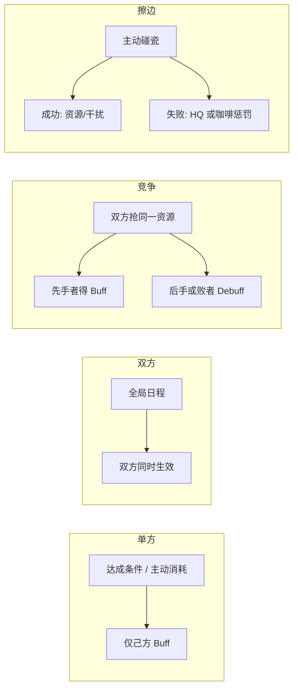
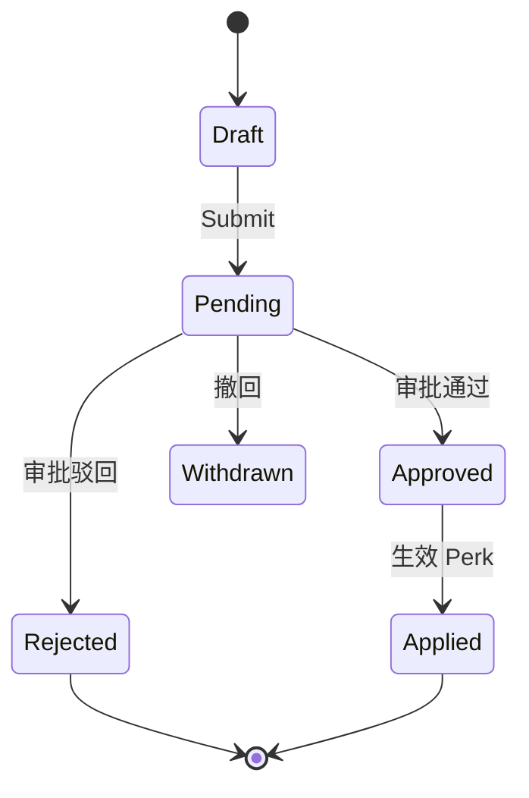
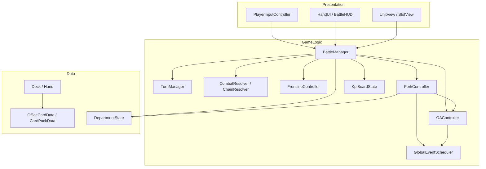

# 游戏项目独立开发策划书：《明天能上线吗》

> **技术栈：** C# + Unity 2022 LTS（或 6000.x）  
> **项目定位：** 🎓 **学习用** — 跟 [`教案.md`](教案.md) 分 20 课实现；源码骨架 + 注释引导，参考答案在 `Reference/`  
> **开发策略：** 每课实现后 Play / 自测；课 17 完成后 Demo 可玩  
> **版本控制：** Git + `.gitignore`（忽略 `Library/`、`Temp/`、`Logs/`）  
>  
> **设计锚点（2026-07 修订）：** **协作完成一个项目** · **德式多轨 KPI** · **回合 = 工作日** · **职位大类 + 子路线特色卡包** · **支持连锁** · **类 Kards 空间战** · **好上手难深入** · **内网开房** · **钉钉感企协作 UI** · **出牌要有甩文档/发消息的打击感**

### 学习路径

| 文档 | 用途 |
|---|---|
| **[`教案.md`](教案.md)** | **主教程**（课 01~20，按序跟做） |
| [`plan.md`](plan.md) | 游戏规则、福利、OA 策划 |
| `Reference/` | 课 17 前的完整 Demo 答案（卡关再看，在 Assets 外） |
| 脚本内 `课 XX` / `LEARN:` | 当课提示 |

---

## 一、 项目基本信息

| 项 | 内容 |
|---|---|
| **正式名** | 《明天能上线吗》 |
| **类型** | 2D / 2.5D **协作**策略卡牌（类 Kards 空间战 + 德式 KPI） |
| **人数** | 2~4 人协作；可单人 + AI 队友 |
| **网络** | **内网开房**（Host / Join by IP）；后期可加公网中继 |
| **难度曲线** | **好上手、难深入**（规则薄，组合厚） |
| **致敬标杆** | 《Kards》（空间阵线）、《镰刀战争》/《璀璨宝石》（德式 KPI）；**视觉对标钉钉工作台 / 审批 / 会话** |
| **美术风格** | **钉钉感企协作 UI**（见下 §1.1） |
| **手感目标** | 出牌像 **发消息 / 甩文档 / 砸纪要**，要有打击感 |
| **目标平台** | PC（Windows / macOS），分辨率 1920×1080 |

### 1.1 美术方向：接近钉钉

整体像 **企业协作客户端**，不是表情包大战或卡通大乱斗。玩家应有「在工作台里打一局 Sprint」的感觉。

| 维度 | 规格 |
|---|---|
| **主色** | 钉钉蓝系：主色 `#0089FF`，悬停/高亮 `#0070D9`，成功绿 `#00B042`，警告橙 `#FF9200`，危险红 `#F25643` |
| **背景** | 浅灰工作台 `#F2F3F5` + 白卡片 `#FFFFFF`；战场可用轻微网格/分割线，避免纯黑暗黑风 |
| **圆角与阴影** | 卡片 8~12px 圆角；阴影轻、低（`0 2px 8px rgba(0,0,0,.06)`），禁止厚重多层 glow |
| **字体** | 清晰中文无衬线（思源黑体 / 苹方类）；标题字重中等，不要手写体、不要表情包字体 |
| **图标** | 线性 + 小面性企业图标（文档、消息、审批、日程），24/32px 栅格对齐 |
| **卡牌形态** | 像 **会话卡片 / 审批单 / 云文档摘要**：顶栏类型标签、标题、两行摘要、底部费用与 KPI 角标 |
| **单位表现** | 工位头像块 + 状态条（精神值），少用夸张 Q 版；受击用闪白 + 红点数字，不要血液特效 |
| **HUD** | 顶栏像工作台：Sprint 日、咖啡、多轨 KPI 进度；侧栏像待办 / OA 审批列表 |
| **动效** | 消息滑入、文档甩落、进度条匀速冲到点；短、稳、有「已发送」反馈，忌抖音风全屏特效 |
| **禁忌** | 紫渐变赛博、暗黑霓虹、贴纸堆叠、过度圆角胶囊按钮墙、报纸排版风 |

**命名寓意：** 职场终极抽象提问——每天都在问，永远没有稳的答案。和 Sprint 倒计时、KPI 是否达标同一气质；钉钉感 UI + 甩文档手感不变。

---

## 二、 核心世界观与胜负判定（协作版）

**剧情背景：** 大厂要上线一个关键项目。玩家们不是互相对砍的部门，而是 **同一项目组里不同职位的人**——产品、研发、设计、测试……必须一起把项目做完，同时应付 **需求风暴、线上故障、老板临时加需求** 等「压力方」。

**设计一句话：** 像 Kards 一样在阵线上推进展、清障碍；像德式桌游一样盯着多条 KPI；像职场群聊一样甩卡要「啪」一声。

### 2.1 回合 = 上班天数

| 概念 | 规则 |
|---|---|
| **1 回合** | **1 个工作日** |
| **Sprint 周期** | 默认 **10 个工作日**（可配置 8~15） |
| **每日流程** | 早会抽牌 → 各职位依次行动 → 日终结算 KPI / 连锁 → 压力方 Tick |
| **加班日（可选）** | 花咖啡换「半日加班」：本职位多行动 1 次，但压力值 +1 |

### 2.2 战场布局（保留 Kards 三行）

压力方与项目组仍用三行空间，便于「占线、推进、远程输出」：

```
[ 压力后方：老板 / 需求池 / 线上火场 (Crisis HQ) ]
────────────────────────────────
[      中央阵线：评审会 / 站会 / 阻塞点      ]   ← 同一时间倾向一方控制
────────────────────────────────
[ 项目组后方：工位区 / 文档区 (Team Back) ]
```

- **项目组**在后方部署「产出单位」（需求、PR、设计稿、用例……）
- **推进到前线** = 把事项推进到评审 / 联调 / 提测
- **攻击压力单位 / Crisis HQ** = 消化阻塞、止血、过评审
- **Manager 类远程** = 在后方「甩 PPT / 发对齐消息」输出，不受反击

### 2.3 共同目标：把项目做成（德式 KPI）

不是「先把对方 HQ 打到 0」，而是 **在截止日期前，多条 KPI 同时达标**。

| KPI（德式计分轨） | 含义 | 达标线（默认） | 主要贡献职位 |
|---|---|---|---|
| **交付进度 Delivery** | 功能合入 / 里程碑 | ≥ 12 | 研发、产品 |
| **质量 Quality** | 缺陷可控、用例覆盖 | ≥ 8 | 测试、研发 |
| **体验 UX** | 设计落地、交互一致 | ≥ 6 | 设计、产品 |
| **士气 Morale** | 团队不崩、能加班 | ≥ 4（且不跌到 0） | 全员 / HR 向 |
| **压力 Pressure** | 老板怒气 / 线上火情（**越低越好**） | ≤ 6（终局） | 全员清障 |

**胜利：** Sprint 结束日（或提前）时，Delivery / Quality / UX / Morale **全部 ≥ 达标线**，且 Pressure **≤ 上限**。  
**失败：** 任一关键 KPI 永久崩盘（如 Morale=0 或 Pressure 爆表），或截止日期到仍未全达标。

**德式味道怎么体现：**
- **多轨并行**，不能只堆一条进度
- **效率 > 运气**：连锁与占位决定分数，少纯 RNG
- **职位不对称**：每人擅长推不同 KPI，必须配合
- **终局结算表**：日终 / 结算弹出「Sprint 复盘」看板（进度条 + 差额）

> **与旧版关系：** 旧「部门互殴、HQ 归零」改为 **协作 vs 压力方**；旧战斗数值可复用为「清阻塞 / 推交付」的空间战层。单机 Demo 仍可用 AI 控压力方 + AI 队友。

### 2.4 难度：好上手，难深入

| 层 | 内容 | 玩家负担 |
|---|---|---|
| **入门（第 1 局）** | 咖啡、出牌占格、推进、打一下压力怪；只看 Delivery + Pressure 两条轨 | 极低 |
| **熟悉** | 解锁 Quality / UX；看懂职位被动 | 低 |
| **深入** | 子路线卡包构筑、连锁窗口、跨职位 combo、OA/福利时序、内网分工 | 高 |

**规则承诺：** 核心动词只有 **出牌 / 推进 / 输出 / 结束今天**；深度来自 **卡牌交互与职位协同**，不加长规则说明书。

---

## 三、 核心战斗与协作机制

### 0. 玩家职位（开局选角，不对称）

每人固定 **1 个职位大类**（2~4 人局大类不重复；单人可带 AI 补位），再选 **1 个子路线（Archetype）**，挂载对应 **特色卡包**。

| 职位 Role | 手感隐喻 | 主推 KPI | 大类被动（示例） | 专属出牌手感 |
|---|---|---|---|---|
| **产品 PM** | 甩需求文档 | Delivery、UX | 部署「需求卡」费用 -1；可标记 1 个阻塞为「本周必做」 | 文档飞入前线，落地「啪」 |
| **研发 Dev** | 提 PR / 修 Bug | Delivery、Quality | 前线输出 +1；连锁里第二段伤害不耗沟通费 | 终端滚动 + 合入音效 |
| **设计 Design** | 甩稿 / 批注 | UX | 后方远程首次免费；给友方单位 +「高保真」标记 | 图层叠放、钢笔「叮」 |
| **测试 QA** | 提缺陷 / 拦发布 | Quality、Pressure | 击杀压力单位时 Quality +1；可「打回」敌方推进 | 红戳盖章、缺陷单弹出 |
| **（可选）Scrum / TL** | 排期 / 站会 | Morale、全轨微调 | 每工作日可让 1 名队友额外行动半次 | 日历砸桌、站会铃 |

#### 0.1 子路线 + 特色卡包（可扩展）

**结构：** `大类 Role` → `子路线 Archetype` → `卡包 Pack`（8~12 张专属牌 + 1 条路线被动）。  
开局：**选大类 → 选子路线 → 组成本局牌库**。同一大类可出多套卡包（内容扩展 / 解锁），保持「好上手」：新手默认用各职 **Starter 包**。

| 大类 | 子路线 Archetype | 卡包特色 | 代表牌（策划向） | 路线被动 |
|---|---|---|---|---|
| **PM** | 业务产品 | 画饼、里程碑、对齐老板 | 《OKR 对齐》《砍掉 P2》《老板说可以》 | 每抬 1 点 Delivery，有 30% Pressure -1 |
| **PM** | 平台 / B 端 | 流程、权限、复杂表单 | 《字段评审》《兼容旧系统》《开白名单》 | 部署「流程类」单位精神值 +2 |
| **PM** | 增长 / 运营向 | 活动、漏斗、数据故事 | 《双十一需求》《埋点清单》《紧急加入口》 | 连锁第 2 段起 Delivery 额外 +1，但 Morale -1 风险 |
| **Dev** | 前端 | 组件、兼容、联调 | 《抽组件》《修样式》《联调握手》 | 占线时 Manager 类输出 +1 |
| **Dev** | 后端 | 接口、性能、稳定性 | 《加缓存》《拆微服务》《半夜热修》 | 击杀「故障」类压力单位时 Quality +1 |
| **Dev** | 客户端 / 原生 | 包体、渠道、热更 | 《打渠道包》《热更新》《机型适配》 | 推进费用 -1，部署费 +1（稳但慢） |
| **Dev** | 基建 / 效能 | CI、工具、脚手架 | 《绿了 CI》《一键环境》《代码生成》 | 全队本工作日首次部署费用 -1 |
| **Design** | UI 视觉 | 规范、组件库、颜值 | 《设计规范》《改一版色板》《走查标注》 | 友方带「高保真」时 UX 日终 +1 |
| **Design** | 交互 UX | 流程、原型、可用性 | 《原型走查》《砍掉三步》《无障碍》 | 标记的阻塞被清除时全队抽 1 |
| **Design** | 动效 / 品牌 | 动效、落地页、氛围 | 《微交互》《品牌 KV》《加载动画》 | 远程输出附带 1 段轻连锁窗口 |
| **QA** | 功能测试 | 用例、回归、拦截 | 《冒烟》《回归套件》《打回开发》 | 「打回」成功时 Pressure -1 |
| **QA** | 自动化 | 脚本、流水线、夜间跑 | 《UI 自动化》《接口回归》《夜间报告》 | 每 2 个工作日自动 Quality +1 |
| **QA** | 性能 / 安全 | 压测、漏洞、稳定性 | 《压测报告》《漏洞单》《熔断建议》 | 对 Engineer 型压力单位输出 +2 |
| **Scrum** | 敏捷教练 | 站会、回顾、WIP 限制 | 《限制在制品》《回顾会》《拆故事》 | 每日可刷新 1 张公共牌 |
| **Scrum** | 技术 TL | 方案、排期、背锅 | 《技术方案》《砍 Scope》《我来顶》 | 可将 1 点伤害转嫁为 Pressure +1 换 Morale 护盾 |

> **扩展规则：** 新内容优先加 **子路线卡包**，少改大类被动；卡包用 ScriptableObject / CSV 配置，`packId` 绑定 `Role + Archetype`。

#### 0.2 本局牌库怎么组

```
本局牌库 = 公共核心包（固定 12~16 张，教规则）
         + 所选子路线特色包（8~12 张）
         + （可选）1 个轻量协同包（跨职连锁催化剂，4 张）
```

| 规则 | 说明 |
|---|---|
| **锁定** | 只能带 **本大类** 的卡包；不能带别的职的专属包 |
| **重复** | 4 人局允许两人同大类吗？**默认不允许**；进阶模式可开「双 Dev」但子路线必须不同 |
| **解锁** | Starter 包默认拥有；通关 / 成就解锁进阶包（如「增长 PM」「安全 QA」） |
| **构筑深度** | 入门：固定 Starter，无选牌；深入：特色包内 8 选 6 + 1 张签名牌 |

**牌库结构（一句话）：** 公共项目牌保证能玩；**子路线卡包**提供「我是哪种产品 / 哪种研发」的个性与深度。

### 1. 双重咖啡资源（Coffee System）

| 概念 | 规则 |
|---|---|
| **咖啡上限** | 开局 1，每工作日开始全队共享或分职位池 +1（上限 12）；当日可用回满 |
| **入职/产出成本（Hire Cost）** | 打出单位/事项卡到项目组后方，扣咖啡 |
| **沟通成本（Action Cost）** | 推进或输出时额外扣；不足则「摸鱼」失败并弱反馈 |

> **协作建议（MVP）：** 咖啡为 **全队共享池**（德式资源紧张感强）；进阶可切「每人私有咖啡 + 1 点公共咖啡」。

### 2. 前线争夺（Frontline）

- 前线同一时间倾向由一方控制（项目组 vs 压力方）
- **项目组占线**：后方远程（设计稿、对齐会、PPT）可安全输出；当日 Delivery 结算 +1（小幅）
- **压力方占线**：可直接砸团队 Morale / 抬 Pressure；项目组后方易被「加需求」骚扰

### 3. 兵种与 JobType（场上单位类型，≠ 玩家职位）

| JobType | Kards 对应 | 职场设定 | 代码特性 |
|---|---|---|---|
| `Intern` | 步兵 | 实习生、外包、琐事票 | 部署费低，占线挡枪 |
| `Engineer` | 坦克 | 核心模块、疑难 PR | 血厚攻高，行动费高 |
| `Manager` | 火炮 | PPT / 对齐消息 / 设计讲解 | 在后方攻击时不受反击 |
| `HR` | 支援 | 行政、团建、心理按摩 | 不可推进，可回血/加攻/抬 Morale |

玩家职位决定 **能高效打出哪些 JobType / 触发哪些连锁**，而不是只能下场一种兵。

### 4. 战斗细则（需在代码中明确实现）

```
部署：手牌 → 项目组后方空位，扣 Hire Cost，播放「甩文档/发消息」演出
推进：后方单位 → 前线，扣 Action Cost，标记 HasActed
输出：前线单位 → 相邻压力单位或 Crisis；或 Manager 后方远程
      双方互扣「产出/阻塞值」（Manager 后方免反击）
死亡：精神值 ≤ 0 → 移除；若击杀带 Combo 标签则进入连锁窗口
日终：重置 HasActed，咖啡回满，工作日 +1，结算 KPI，压力方行动
```

**前线冲突（MVP）：** 先到达者占线；同日对撞时互扣，存活者占线。

### 5. 链式反应（Combo Chain）— 必须支持

目标：一手牌打出后，**满足条件的后续效果自动/半自动接上**，形成「群里消息刷屏」式节奏。

| 规则 | 说明 |
|---|---|
| **连锁窗口** | 某次输出/部署结算后开启 **Chain Window**（约 1.2s 表现时间） |
| **触发标签** | 卡牌带 `OnPlay` / `OnAdvance` / `OnKill` / `OnAllyPlay` 等 |
| **跨职位加成** | 例：PM 刚甩「需求」→ Dev 本窗口打出「实现」费用 -1 且 Delivery +1 |
| **队列结算** | 连锁效果入队，**依次播放**（禁止同帧吞掉打击感） |
| **上限** | 单日连锁最多 **5** 段（防无限；第 6 段提示「群已禁言」） |
| **深度** | 入门局关闭复杂跨职连锁，只留「击杀再抽 1」级简单链 |

**示例连锁（策划用）：**

```
PM《对齐需求》部署
  → 标记前线「可开发」
  → Dev《提 PR》费用 -1，打出后 Delivery +1
    → 若占线：QA《冒烟用例》自动免费盖章，Quality +1
      → 若击杀「阻塞」：全队抽 1，Morale +1
```

### 6. 出牌手感与打击感（Juice）

卡牌不是安静扣费，而是 **职场沟通动作**：

| 出牌类型 | 表现 | 音频 / 反馈 |
|---|---|---|
| 部署事项 | 卡片甩向格子，微旋转 + 落地缩放 | 纸张「啪」、桌面震 1 帧 |
| 发消息类 | 气泡从手牌飞到目标，尾迹 | 微信/企微提示音（原创拟声） |
| 推进前线 | 单位滑步 + 进度条砸满 | 谁谁「已提测」系统音 |
| 输出/清障 | 数字暴击弹出、受击闪白 | 重击 + UI 短震动 |
| 连锁段 | 每段递增音高 / 屏幕微闪 | 「+1 连击」角标 |
| KPI 上涨 | 对应轨进度条猛冲、超额闪金 | 记账机「叮」 |

**原则：** 每个成功动作必须有 **动画 + 音效 + 数值跳字** 三件套；失败（摸鱼）用软塌动画，不要无反馈。

### 7. 公司福利系统（Perk System）— 下一阶段重点

在咖啡 / Crisis / 卡牌之外，增加 **「项目组福利」** 层，用职场梗包装单方与全队奖励（协作局以 **抬 KPI / 降 Pressure** 为主，少用「害队友」）。

#### 7.1 三类福利

| 类型 | 含义 | 示例 |
|---|---|---|
| **单方福利** | 本部门正当好处，仅己方生效 | 下午茶、团建、弹性办公 |
| **双方福利** | 公司 HR 统一通知，影响双方 | 全员培训、行政发奶茶 |
| **竞争福利** | 一方得手、另一方吃亏 | 抢订下午茶、**抢零食** |
| **擦边福利** | 单方冒险，成功血赚、失败翻车 | **偷前台东西** |



#### 7.2 福利清单（策划）

**单方福利**

| ID | 名称 | 触发 | 效果 |
|---|---|---|---|
| `tea_break` | 下午茶 | 主动：花 2 咖啡 | 本回合所有单位沟通费 -1 |
| `tea_break_passive` | 行政送奶茶 | 每 3 回合自动 | 抽 1 张牌 |
| `team_building` | 团建 | 连续占前线 2 回合 | 全体友军精神值 +2，本局上限 +1 |
| `flex_work` | 弹性办公 | 本局首次部署 | 第一张员工卡入职费 -1 |
| `late_night_snack` | 夜宵报销 | 本回合击杀敌方单位 | 下回合额外 +1 咖啡 |

**竞争福利**

| ID | 名称 | 触发 | 效果 |
|---|---|---|---|
| `tea_rush` | 抢订下午茶 | 双方均可抢（竞争） | 先花 3 咖啡者拿 Buff；另一方本回合 -1 咖啡 |
| `snack_rush` | 抢零食 | 第 3、7、11 回合开放抢答 | 先花 1 咖啡者抽 1 牌并 +1 咖啡；另一方「被行政记名」：下回合少抽 1 牌 |
| `snack_rush_tie` | （平局规则） | 同回合双方同时抢 | 均不得利；双方各 -1 咖啡（行政收走零食柜） |

**擦边福利**

| ID | 名称 | 触发 | 效果 |
|---|---|---|---|
| `steal_reception` | 偷前台东西 | 主动：0 咖啡，3 回合冷却 | **成功**（基础 60%）：+2 咖啡或敌方 HQ -1（顺走签到簿） |
| | | | **失败**（40%）：己方 HQ -2，日志「前台监控已记录」 |
| `steal_reception_risk` | （风险修正） | 敌方占前线时 | 成功率 -20%（前台有人盯着） |
| `steal_reception_crit` | （大成功） | 10% 概率 | 额外抽 1 张牌，文案「顺手牵羊还摸到了加班券」 |

**双方福利**

| ID | 名称 | 触发 | 效果 |
|---|---|---|---|
| `company_training` | 全员培训 | 第 5、9 回合 | 双方咖啡上限 +1 |
| `hr_milk_tea` | 行政发奶茶 | 随机回合（HQ 均 > 10） | 双方 HQ 各 +3 |
| `cross_dept_outing` | 跨部门团建 | 双方 HQ 均 > 10 | 双方各抽 1 牌；下回合双方不可攻击 HQ |

#### 7.3 与现有系统的挂钩点

| 时机 | 检查 / 结算 |
|---|---|
| `BeginTurn` | 回合类福利、全局日程、`GlobalEventScheduler` |
| `TryPlayCardFromHand` | 弹性办公、入职费减免 |
| `TryAdvanceUnit` / `TryAttack` | 下午茶沟通费减免 |
| 占线状态变化 | 团建连占线计数；偷前台成功率修正（敌方占线 -20%） |
| 单位击杀 | 夜宵报销 |
| 全局回合 | `snack_rush` 开放窗口（3/7/11 回合） |
| UI 按钮 | `TryActivatePerk(TeaBreak / SnackRush / StealReception)` |
| 竞争结算 | `PerkController.ResolveCompetitivePerk`：比谁先激活、同回合平局 |
| 随机判定 | `StealReception` 成功/失败/大成功 |
| OA 提交 | `OAController.TrySubmit` → Pending；占行政带宽 |
| OA 结算 | `BeginTurn` → `TickApprovals` → `OnOAApproved` → 激活 Perk |

### 8. OA 审批系统（Office Automation）— 与福利联动

把 **「走 OA」** 做成独立玩法层：**福利不是点了就生效，多数要先提单、等审批**（和真实大厂一致）。  
「偷前台」等擦边行为可 **不走 OA** 或 **走假单据**，形成正当流程 vs 野路子 的对比。

#### 8.1 设计目标

| 目标 | 说明 |
|---|---|
| **沉浸感** | 团建、下午茶、零食领用 = 填单 → 审批 → 到账 |
| **策略深度** | 审批耗时、加急、预算池、驳回风险 |
| **与战斗耦合** | 审批中占用「行政带宽」；通过单据强化 Perk |
| **可扩展** | 抽象 `IOABackend`，后期可对接真实 OA（飞书/钉钉/自研） |

#### 8.2 OA 单据类型（Form → 游戏效果）

| FormType | 单据名称 | 关联 Perk | 审批链 | 通过后效果 |
|---|---|---|---|---|
| `TeaBreakApply` | 下午茶申请单 | `tea_break` | 直属主管 | 本回合沟通费 -1 |
| `TeamBuildingApply` | 团建活动申请 | `team_building` | 主管 → HR | 全体友军 +2 精神值 |
| `SnackRequisition` | 零食领用单 | `snack_rush` | 行政（先到先得） | 抽 1 牌 +1 咖啡 |
| `TrainingBudget` | 培训预算单 | `company_training` | HR（系统单） | 双方咖啡上限 +1 |
| `ExpenseReport` | 夜宵报销单 | `late_night_snack` | 主管 → 财务 | 下回合 +1 咖啡 |
| `SupplyRequest` | 办公物资申领 | （掩护） | 前台 | 成功则 +1 咖啡；**偷前台**可伪造此单 |
| `UrgentStamp` | 加急审批单 | 元操作 | 总监 | 任意在审单据 **本回合立刻下结论** |

**不走 OA（即时生效 / 非法）**

| 行为 | 说明 |
|---|---|
| `steal_reception` | 不提交单据直接行动；或提交 `SupplyRequest` 伪装（驳回率更高） |
| `tea_rush` 抢订 | 走竞争逻辑，可同时弹「行政：今日下午茶额度已抢光」 |

#### 8.3 审批状态机



| 状态 | 玩家可见 | 规则 |
|---|---|---|
| `Draft` | 表单草稿 | 可改备注，未占带宽 |
| `Pending` | 审批中 | 占用 1 点「行政带宽」；默认 **下回合开始** 出结果 |
| `Approved` | 已通过 | 立即或下回合初触发 Perk |
| `Rejected` | 已驳回 | 扣 1 咖啡或 HQ -1；日志「主管：理由不充分」 |
| `Withdrawn` | 已撤回 | 返还半额咖啡（若已付） |

#### 8.4 核心规则

**行政带宽（Admin Capacity）**
- 每部门每回合最多 **2 张在审单据**（可配置）
- 超出则提示「行政系统繁忙，请先处理待办」

**公司福利预算池（Welfare Budget Pool）**
- 全局共享，初始 10 点；团建/下午茶/零食各消耗 1~3 点
- 预算不足 → 单据 **自动驳回** 或转入「排队下一回合」
- 双方竞争：同一回合都申请团建 → 先提交者占预算

**审批耗时**
- 默认：**提交后下一回合己方 `BeginTurn` 时结算**
- **加急单（`UrgentStamp`）**：花 2 咖啡，本回合 `EndTurn` 前出结果
- 敌方占前线：己方审批 **延迟 +1 回合**（「主管在开会」）

**审批人（Approver）— MVP 用规则模拟，不对接真人**

| 角色 | 通过倾向 | 特殊规则 |
|---|---|---|
| 直属主管 | 70% | 己方 HQ > 15 时 +10% |
| HR | 60% | 团建/培训类 +15% |
| 行政 | 先到先得 | 零食类仅 1 份/窗口 |
| 前台 | 40% | `SupplyRequest` 伪装偷前台时 -20% |

#### 8.5 与 Perk 的调用关系

```
玩家点「下午茶」
    ↓
PerkController 检查：该 Perk 是否 requiresOA？
    ↓ 是
OAController.Submit(TeaBreakApply) → Pending
    ↓ 下回合 BeginTurn
OAController.TickApprovals() → Approved
    ↓
PerkController.Activate(TeaBreak)
    ↓
BattleManager 正常结算 Buff
```

**快捷通道（Demo 可选）**
- 战斗教程前 2 回合：下午茶 **免审批**（新手保护）
- 设置里「打工人模式」：全部福利免 OA（纯战斗测试）

#### 8.6 对接「现有 OA 系统」的扩展口

若你司有真实 OA（自研 / 飞书 / 钉钉），用适配器接入，**游戏内仍走同一套 `OARequest` 模型**：

```csharp
public interface IOABackend
{
    Task<string> SubmitAsync(OARequest request);   // 返回外部单号
    Task<OARequestStatus> PollAsync(string externalId);
    Task<bool> WithdrawAsync(string externalId);
}

// MVP
public sealed class LocalSimOABackend : IOABackend { /* 规则表模拟 */ }

// 后期
public sealed class HttpOABackend : IOABackend { /* REST Webhook */ }
public sealed class FeishuOaAdapter : IOABackend { /* 飞书审批实例 */ }
```

**映射表（策划维护 CSV / SO）**

| 游戏 FormType | 外部流程 template_id | 备注 |
|---|---|---|
| `TeaBreakApply` | （填你司真实模板 ID） | |
| `TeamBuildingApply` | | |
| `SnackRequisition` | | |

> 你提供现有 OA 的 **单据类型列表 + 审批节点** 后，把上表补全即可 1:1 还原。

#### 8.7 UI 入口（战斗场景内）

| UI | 内容 |
|---|---|
| **OA 待办角标** | 审批中 N 条；驳回红点 |
| **OA 面板** | 列表：单号 / 类型 / 状态 / 预计生效工作日 |
| **发起申请** | 从 Perk 按钮跳转预填表单，或独立「+ 新建申请」 |
| **加急** | 对已 Pending 单据点「找总监加急」 |

### 9. 内网开房（LAN Multiplayer）

支持 **同一局域网内 Host 开房、他人 Join**，适合办公室 / 宿舍联机。

| 项 | MVP 规格 |
|---|---|
| **拓扑** | Listen Server：房主既是 Host 又是玩家 |
| **发现** | 房间列表：手动输入 IP:Port；可选 UDP Broadcast 局域网发现 |
| **房间** | 房间名、人数 2~4、选职位锁位、房主点「开始 Sprint」 |
| **同步模型** | **锁步 / 指令同步**：只同步玩家操作（出牌、推进、输出、结束今天），逻辑权威在 Host |
| **回合秩序** | 每日按座位顺序行动（或同时选牌、Host 统一结算——进阶） |
| **断线** | 掉线位转 AI 托管；房主掉线则房间解散（MVP） |
| **单机** | 无网络时 Host 本地 + AI 压力方 / AI 队友 |

**技术选项（Unity）：**
- 学习向 MVP：`Unity Transport` + 自研薄封装，或 **Mirror / Netcode for GameObjects**（选一种，教案后期单独立课）
- **不要**在核心战斗未稳前接网络；先保证单机协作规则可跑，再抽 `IGameCommand` 做联机

```csharp
public interface IGameCommand {
    int DayIndex { get; }
    PlayerRole Actor { get; }
    void Validate(GameState state);
    void Apply(GameState state); // Host 执行后广播结果事件
}
// PlayCardCommand / AdvanceCommand / AttackCommand / EndDayCommand / ActivatePerkCommand
```

**联机 UX：**
- 大厅：职位头像锁定、准备状态
- 战斗：看得到队友手牌数量（默认不看牌面，可开「协作明牌」休闲模式）
- 出牌时全员播放同一套「甩文档」演出，保证打击感一致

---

## 四、 Unity 工程结构

### 4.1 推荐目录

```
Assets/
├── _Project/
│   ├── Scenes/
│   │   ├── Boot.unity              # 初始化、加载配置
│   │   └── Battle.unity            # 主战斗场景
│   ├── Scripts/
│   │   ├── Core/                   # 枚举、常量、事件总线
│   │   ├── Data/                   # ScriptableObject 定义
│   │   ├── Cards/                  # 卡牌实例、卡组、手牌
│   │   ├── Battlefield/            # 格子、前线、单位实体
│   │   ├── Combat/                 # 伤害、连锁 ChainResolver
│   │   ├── Resources/              # 咖啡、CrisisBudget、KpiBoardState
│   │   ├── Perks/                  # 福利定义、触发、全局事件
│   │   ├── OA/                     # 审批单据、流程、Backend 适配
│   │   ├── Turn/                   # 工作日 / Sprint 状态机
│   │   ├── Input/                  # 点击、拖拽、选中
│   │   ├── AI/                     # SimpleCrisisAI 压力方
│   │   ├── Demo/                   # BattleDemoBootstrap
│   │   └── UI/                     # HandUI、BattleHUD（KPI）、PerkHUD、OAPanel
│   ├── ScriptableObjects/
│   │   └── Cards/                  # 各卡牌 .asset 配置
│   ├── Prefabs/
│   │   ├── CardView.prefab
│   │   ├── UnitView.prefab         # 先用 Cube + TextMeshPro
│   │   └── SlotView.prefab         # 格子高亮
│   ├── Art/                        # 后期：贴图、Spine 等
│   └── Audio/
├── Plugins/                        # 第三方（如 DOTween，可选）
└── Settings/                       # URP/Input System 等
```

### 4.2 核心依赖（Package Manager）

| 包 | 用途 |
|---|---|
| **TextMeshPro** | 卡牌名、数值、KPI 进度、CrisisBudget |
| **Input System**（可选） | 统一鼠标/触控 |
| **Unity UI (uGUI)** | 手牌、按钮、HUD |
| **2D Sprite** 或 **URP** | 2D 正交相机或轻量 3D |

**MVP 阶段不必引入：** Addressables、Timeline。  
**联机阶段再引入：** Unity Transport / Netcode 或 Mirror（见 §三.9）。

---

## 五、 C# 架构设计

### 5.1 分层关系



**原则：**
- **数据（SO + 运行时 State）** 与 **表现（MonoBehaviour View）** 分离
- `BattleManager` 作为单场战斗的 Facade，不直接在 View 里写扣血逻辑
- 用 **C# event** 或 **ScriptableObject Event Channel** 通知 UI 刷新

### 5.2 核心类型一览

#### 枚举与常量 — `Core/GameEnums.cs`

```csharp
public enum JobType { Intern, Engineer, Manager, HR }
public enum PlayerRole { PM, Dev, Design, QA, Scrum }  // 职位大类
public enum RoleArchetype {
    // PM
    PmBusiness, PmPlatform, PmGrowth,
    // Dev
    DevFrontend, DevBackend, DevClient, DevInfra,
    // Design
    DesignVisual, DesignUX, DesignMotion,
    // QA
    QaFunctional, QaAutomation, QaPerfSec,
    // Scrum
    ScrumAgile, ScrumTechLead
}
// CardPackData: packId, role, archetype, cards[], routePassiveId
public enum Faction { Team, Crisis }                   // 项目组 vs 压力方（原 Player/Enemy）
public enum BoardRow { TeamBack, Frontline, CrisisBack }
public enum TurnPhase { MorningStandup, Main, DayEnd }
public enum GameResult { Ongoing, TeamWin, TeamLose }
public enum KpiTrack { Delivery, Quality, UX, Morale, Pressure }
public enum PerkType {
    TeaBreak, TeamBuilding, FlexWork,
    CompanyTraining, TeaRush,
    SnackRush, StealReception  /* ... */
}
public enum PerkScope { Self, Both, Competitive, Risky }
public enum PerkTrigger { Manual, OnTurnStart, OnFrontlineHold, GlobalSchedule, OnKill, GlobalRoundWindow, OnOAApproved }
public enum OAFormType { TeaBreakApply, TeamBuildingApply, SnackRequisition, TrainingBudget, ExpenseReport, SupplyRequest, UrgentStamp }
public enum OARequestStatus { Draft, Pending, Approved, Rejected, Withdrawn, Applied }
public enum CardFeel { ThrowDoc, SendMessage, StampBug, MergePR, AlignMeeting }
```

#### 卡牌配置 — `Data/OfficeCardData.cs`（ScriptableObject）✅ 已有概念

```csharp
[CreateAssetMenu(menuName = "OfficeWar/Card")]
public class OfficeCardData : ScriptableObject
{
    public string cardId;
    public string displayName;
    public JobType job;
    public int hireCost;
    public int actionCost;
    public int maxMorale;      // 精神值 / HP
    public int kpi;            // 攻击力
    public Sprite icon;        // 后期
    public bool canAdvance = true;
    public bool isSupport;     // HR 等
}
```

#### 运行时卡牌实例 — `Cards/RuntimeCard.cs`

```csharp
public sealed class RuntimeCard
{
    public OfficeCardData Data { get; }
    public int InstanceId { get; }
    // 与场上 Unit 绑定后由 UnitEntity 持有
}
```

#### 部门状态 — `Resources/DepartmentState.cs`（对应已有 DepartmentManager）

```csharp
public class DepartmentState
{
    public Faction Faction { get; }
    public int HqBudget { get; private set; }      // 初始 20
    public int CoffeeMax { get; private set; }     // 1~12
    public int CoffeeCurrent { get; private set; }

    public bool TrySpendCoffee(int amount);
    public void RefillCoffee();
    public void IncreaseCoffeeMax();               // 每回合开始 +1
    public void TakeHqDamage(int amount);
    public List<ActivePerk> ActivePerks { get; }   // 阶段 8 新增
}
```

#### 福利运行时 — `Perks/`（阶段 8 新增）

```csharp
public sealed class PerkDefinition
{
    public PerkType type;
    public PerkScope scope;
    public PerkTrigger trigger;
    public int coffeeCost;           // 主动福利消耗
    public int durationTurns;        // 持续回合
    public int actionCostReduction;  // 下午茶等
}

public sealed class ActivePerk
{
    public PerkDefinition Def { get; }
    public Faction Owner { get; }
    public int TurnsRemaining { get; set; }
}

public sealed class PerkController
{
    public bool TryActivate(Faction faction, PerkType type);
    public void OnTurnStarted(Faction faction, int turnNumber);
    public void OnFrontlineChanged(Faction? owner);
    public int GetActionCostModifier(Faction faction);
    public int GetHireCostModifier(Faction faction, bool isFirstDeployThisBattle);
    public bool IsCompetitiveWindowOpen(PerkType type, int turnNumber);
    public bool ResolveStealReception(Faction faction, out StealResult result);
}

public enum StealResult { Fail, Success, Crit }

public sealed class GlobalEventScheduler
{
    public void Tick(int turnNumber, BattleManager battle);
}
```

#### OA 审批 — `OA/`（阶段 9 新增）

```csharp
public sealed class OARequest
{
    public string RequestId { get; }
    public OAFormType FormType { get; }
    public Faction Applicant { get; }
    public OARequestStatus Status { get; set; }
    public int SubmittedTurn { get; }
    public int ResolveTurn { get; }
    public PerkType? LinkedPerk { get; }
    public string ExternalId { get; set; }
}

public sealed class OAController
{
    public IReadOnlyList<OARequest> Inbox(Faction faction);
    public bool TrySubmit(Faction faction, OAFormType form, PerkType? linkedPerk);
    public bool TryUrgent(Faction faction, string requestId);
    public void TickApprovals(int turnNumber);
    public int WelfareBudgetRemaining { get; }
}

public interface IOABackend
{
    Task<string> SubmitAsync(OARequest request);
    Task<OARequestStatus> PollAsync(string externalId);
}
```

#### 战场格子 — `Battlefield/BoardSlot.cs`

```csharp
public class BoardSlot
{
    public BoardRow Row { get; }
    public int ColumnIndex { get; }                 // MVP: 每行 1 格即可，后期可扩展多列
    public Faction? OwnerForFrontline { get; set; } // 仅 Frontline 行使用
    public UnitEntity Occupant { get; set; }
    public bool IsEmpty => Occupant == null;
}
```

#### 单位实体 — `Battlefield/UnitEntity.cs`

```csharp
public class UnitEntity
{
    public RuntimeCard Source { get; }
    public Faction Faction { get; }
    public BoardSlot Slot { get; set; }
    public int CurrentMorale { get; private set; }
    public bool HasActedThisTurn { get; set; }

    public bool CanAct(int availableCoffee) =>
        !HasActedThisTurn && availableCoffee >= Source.Data.actionCost;

    public void TakeDamage(int amount);
    public bool IsDead => CurrentMorale <= 0;
}
```

#### 战斗结算 — `Combat/CombatResolver.cs`

```csharp
public static class CombatResolver
{
    // 单位互殴：双方同时扣 KPI
    public static void ResolveUnitVsUnit(UnitEntity attacker, UnitEntity defender);

    // 攻击 HQ：仅扣敌方预算
    public static void ResolveUnitVsHq(UnitEntity attacker, DepartmentState targetHq);

    // Manager 在后方攻击：defender 不反击
    public static void ResolveRangedAttack(UnitEntity attacker, UnitEntity defender, bool attackerInBackRow);
}
```

#### 回合管理 — `Turn/TurnManager.cs`

```csharp
public class TurnManager : MonoBehaviour
{
    public Faction ActiveFaction { get; private set; }
    public TurnPhase Phase { get; private set; }
    public int TurnNumber { get; private set; }

    public event Action<Faction> OnTurnStarted;
    public event Action<Faction> OnTurnEnded;

    public void StartBattle();
    public void EndTurn();  // 玩家点「结束回合」或 AI 完成
}
```

#### 战斗总控 — `Battle/BattleManager.cs`

```csharp
public class BattleManager : MonoBehaviour
{
    // 组合：TurnManager, FrontlineController, Hand, Deck, 双方 DepartmentState
    public GameResult Result { get; private set; }

    public bool TryPlayCardFromHand(RuntimeCard card, BoardSlot targetSlot);
    public bool TryAdvanceUnit(UnitEntity unit);
    public bool TryAttack(UnitEntity attacker, IAttackTarget target);
    public void EndPlayerTurn();
}
```

---

## 六、 场景与 Prefab 搭建（MVP）

### 6.1 Battle 场景层级

```
Battle (Scene)
├── Main Camera (Orthographic)
├── BattleManager          [BattleManager, TurnManager]
├── Board
│   ├── Row_PlayerBack     → SlotView × 1（或 3）
│   ├── Row_Frontline      → SlotView × 1
│   └── Row_EnemyBack      → SlotView × 1
├── Units                  （运行时 Instantiate UnitView）
├── UI
│   ├── Canvas
│   │   ├── HUD_Coffee
│   │   ├── HUD_HQ_Player / HUD_HQ_Enemy
│   │   ├── HandPanel
│   │   ├── PerkPanel          # 下午茶 / 抢零食 / 偷前台
│   │   ├── OAPanel            # 待办、发起申请、加急、驳回原因
│   │   └── Btn_EndTurn
└── EventSystem
```

### 6.2 UnitView（占位美术）

- `Cube` 或 `UI Image` + `TextMeshPro` 显示：`名称 | 精神值 | KPI`
- 颜色区分 Faction：Player = 蓝，Enemy = 红
- JobType 用子物体小图标或字母 I/E/M/H

### 6.3 输入流程（MVP 用点击，不用拖拽）

1. 点击手牌 → 进入「部署模式」，高亮可放置的己方后方格
2. 点击空格 → `BattleManager.TryPlayCardFromHand`
3. 点击己方单位 → 进入「行动模式」，显示可推进 / 可攻击目标
4. 点击目标格或敌方单位 → 执行推进或攻击
5. 点击「结束回合」→ `EndPlayerTurn`
6. 点击福利 → 若需 OA 则打开申请单；否则 `TryActivatePerk`
7. 打开 **OA 面板** → 查看待办 / 加急 / 撤回
8. 点击「结束回合」→ 审批队列 Tick

---

## 七、 分阶段开发路线图（阶段管理）

> **最后更新：** 2026-07-12  
> **当前进度：** 📖 协作版骨架已同步；跟 [`教案.md`](教案.md) 从 **课 02** 开始（课 01 阅读）  
> **说明：** Assets 为协作版 `LEARN:` 骨架；`Reference/` 仅 Core 枚举/常量已对齐，旧战斗答案作结构参考。

### 7.0 总览看板

| 阶段 | 名称 | 教案 | 说明 |
|:---:|---|:---:|---|
| 0 | 工程初始化 | 课 01 | 阅读 + 环境 |
| 1~7 | 核心战斗 | **课 02~17** | 骨架在 `Scripts/`，答案在 `Reference/` |
| 8 | 公司福利 | **课 18~19** | `Scripts/Perks/` |
| 9 | OA 审批 | **课 20** | `Scripts/OA/` |
| 10~12 | 扩量 / Roguelike / 打磨 | plan §七 | 无骨架，自选 |

**图例：** 📖 = 跟教案动手实现 · ⚪ = 策划参考、自行探索

**说明：** 原「已实现」代码已移至 **`Reference/`**（Assets 外）；`Assets/_Project/Scripts/` 内为带 `课 XX` 注释的骨架。

**阶段门禁（进入下一阶段前必须满足）：**

| 从 → 到 | 门禁条件 |
|---|---|
| 7 → 8 | 能完整打完一局（Team + Crisis AI），KPI 胜负 UI 正常 |
| 8 → 9 | 5 个福利可触发；Perk 与 OA 解耦（`requiresOA` 标记就绪） |
| 9 → 10 | 下午茶/团建/零食走 OA 全流程；待办 UI；加急可用；驳回有日志 |
| 10 → 11 | 30+ 卡牌 + 构筑界面可选 20 张 |
| 11 → 12 | 地图节点能串联 3 场以上战斗 |

---

### 阶段 0：工程初始化 — ✅ 完成

- [x] 创建 Unity 项目（2D/3D，相机正交）
- [x] 建立 `_Project` 目录结构
- [x] 配置 Git，添加 Unity `.gitignore`
- [x] 创建 `Battle` 场景 + `BattleDemoBootstrap`
- [x] 定义 `GameEnums.cs`、`GameConstants.cs`

**验收：** ✅ 空场景 Play 无报错；Editor 菜单 `Office War/Setup Demo Scene` 可用。

---

### 阶段 1：数据与资源池 — 🟡 基本完成

- [x] `OfficeCardData` ScriptableObject
- [x] `DepartmentState`：咖啡扣费、HQ 血量
- [x] `CardCatalog`：8 种内置测试卡（Demo 免 SO 资产）
- [ ] 在 `ScriptableObjects/Cards/` 创建正式 `.asset` 资产（从代码迁移）
- [ ] EditMode 单元测试：`DepartmentState`、`TrySpendCoffee`

**验收：** 🟡 运行时读卡正确；SO 资产化与测试待补。

---

### 阶段 2：卡组、手牌与 UI — ✅ 完成

- [x] `Deck` / `Hand` / `RuntimeCard`
- [x] 开局抽 3 张，回合抽 1 张
- [x] `HandUI` + `CardView`
- [x] `BattleHUD`：咖啡、HQ、回合、日志

**验收：** ✅ 手牌与 HUD 同步。

---

### 阶段 3：部署单位到后方 — ✅ 完成

- [x] `BoardSlot` + `BoardController`
- [x] `SlotView` 高亮
- [x] `UnitFactory` + `UnitView`（Cube 占位）
- [x] `TryPlayCardFromHand` 完整校验

**验收：** ✅ 点击手牌 → 后方格 → Cube 出现，咖啡扣除。

---

### 阶段 4：前线与移动 — ✅ 完成

- [x] `FrontlineController`：`GetOwner` / `CanAdvanceToFrontline`
- [x] `TryAdvanceUnit`：扣 Action Cost、占线
- [x] HR 不可推进

**验收：** ✅ 推线后前线归属更新。

---

### 阶段 5：战斗与 HQ 攻击 — ✅ 完成

- [x] `CombatResolver`：互殴、HQ、Manager 免反击
- [x] `GameResult` + 胜负面板

**验收：** ✅ HQ 归零弹出胜负 UI。

---

### 阶段 6：回合流转与 HR 技能 — ✅ 完成

- [x] `TurnManager`：切换行动方、回合计数
- [x] 回合开始：咖啡上限 +1、回满、抽牌
- [x] HR：治疗 +3 / 行政小姐姐 KPI +2
- [x] 「结束回合」按钮

**验收：** ✅ 多回合循环正常。

---

### 阶段 7：敌方 AI — ✅ 完成

- [x] `SimpleEnemyAI`：部署 → 推进 → 攻击 → 结束回合
- [x] 行动间隔 ~0.6s

**验收：** ✅ 单人可完整打完一局。

**已知 Demo 限制：** 每行仅 1 格；卡牌为 `CardCatalog` 硬编码；无音效。

---

### 阶段 8：公司福利系统 — 📖 学习练习

> **骨架路径：** `Assets/_Project/Scripts/Perks/` · `UI/PerkHUD.cs`  
> **练习清单：** `LEARNING.md` → 阶段 8  
> **策划规则：** 本章 §三.7  
> **挂钩点：** `BattleManager.cs` 搜索 `LEARN [阶段8]`

**已提供（勿删）：** 空壳类 + 文件头 `LEARN:` 步骤说明 + 日志占位 `TryActivatePerk`。

**你需要完成：**

| 练习 | 文件 | 验收 |
|:---:|---|---|
| 8.1 | `PerkEnums.cs`, `PerkDefinition.cs`, `PerkCatalog.cs` | 至少 3 条福利配置可读 |
| 8.2 | `PerkController.cs` | 下午茶减沟通费可 Play 验证 |
| 8.3 | `CompetitivePerkResolver.cs`, `StealReceptionResolver.cs` | 抢零食 / 偷前台有日志 |
| 8.4 | `PerkHUD.cs` + Bootstrap 挂载 | 按钮可点并触发逻辑 |

**福利设计目标（实现时对照 §三.7）：** 下午茶、团建、全员培训、抢零食、偷前台。

---

### 阶段 9：OA 审批系统 — 📖 学习练习

> **骨架路径：** `Assets/_Project/Scripts/OA/` · `UI/OAPanel.cs`  
> **练习清单：** `LEARNING.md` → 阶段 9  
> **策划规则：** 本章 §三.8  

**已提供：** `OAController`、`OARequest`、`LocalSimOABackend` 空壳与注释。

**你需要完成：**

| 练习 | 文件 | 验收 |
|:---:|---|---|
| 9.1 | `OAEnums.cs`, `OARequest.cs`, `OAController.cs` | 提单 → Pending → Approved |
| 9.2 | 与 `PerkController` 联动 | `requiresOA` 走审批后再 Buff |
| 9.3 | `LocalSimOABackend.cs`, `WelfareBudgetPool` | 驳回/预算不足有日志 |
| 9.4 | `OAPanel.cs` | 待办列表 + 加急 |

---

### 阶段 10：内容扩量 — ⚪ 未开始

- [ ] 卡牌 SO 化：从 `CardCatalog` 迁移到 `.asset`
- [ ] 卡牌扩至 30+；OA 单据扩展（报销单、出差单 → 新 Perk）
- [ ] 多列战场（每行 3 格）
- [ ] 构筑界面：选 20 张进 Deck
- [ ] EditMode / PlayMode 单元测试补全
- [ ] 福利 + OA 扩至完整清单（§三.7、§三.8 全部条目）
- [ ] **职位选角 + 子路线卡包 + KPI 结算看板**（协作胜负）
- [ ] 各职 Starter 包各 1 套（PM/Dev/Design/QA）；进阶包可后补
- [ ] `CardPackData` SO：`Role + Archetype + cards`
- [ ] **连锁窗口 ChainResolver**
- [ ] **出牌 Juice**（甩文档 / 发消息三件套）
- [ ] **内网开房大厅**（Host/Join，指令同步；大厅选大类+子路线）

**验收：** 可选牌构筑；多列部署；测试覆盖战斗 + 福利 + OA。

---

### 阶段 11：Roguelike 层 — ⚪ 未开始

- [ ] 地图节点：战斗 / 休息 / **OA 办事大厅** / 福利商店 / 精英
- [ ] 跨场保留：轻量 Deck 调整、福利解锁、审批信用（通过率加成）
- [ ] 章节 Boss 战

**验收：** 一条路线至少 3 连战。

---

### 阶段 12：打磨发布 — ⚪ 未开始

- [ ] 音效：部署甩文档、发消息、攻击、连锁连击、福利、**OA 叮一声审批通过**、Sprint 胜利/失败
- [ ] 打击感：落地震屏、跳字、进度条冲刺（对照 §三.6）
- [ ] 2D 资源按 §1.1 钉钉感工作台规范替换 Cube；福利 / OA / 职位独立 icon
- [ ] 会话卡片式卡面、工作台顶栏 KPI、审批列表面板
- [ ] 存档：Statistics、解锁卡牌与福利、OA 成就（「从未被驳回」）、职位熟练度
- [ ] 内网开房稳定性与 AI 托管
- [ ] 平衡性迭代（KPI 达标线、连锁上限、咖啡共享）

---

## 八、 模块依赖顺序（开发顺序强制建议）

```
GameEnums / Constants
    ↓
OfficeCardData (SO) + 测试卡资产
    ↓
DepartmentState
    ↓
Deck / Hand / RuntimeCard
    ↓
BoardSlot / UnitEntity / BoardController
    ↓
BattleManager（部署）
    ↓
FrontlineController + TryAdvanceUnit
    ↓
CombatResolver + HQ 胜负
    ↓
TurnManager + EndTurn
    ↓
HandUI / BattleHUD / Input
    ↓
SimpleEnemyAI
    ↓
PerkController + GlobalEventScheduler
    ↓
PerkHUD + requiresOA 标记
    ↓
OAController + LocalSimOABackend + OAPanel    ← 阶段 9
    ↓
（可选）HttpOABackend / 飞书 Adapter
    ↓
卡牌 SO 化 / 多列 / 构筑
    ↓
Roguelike 地图（含 OA 办事节点）
```

**不要并行写** Combat 与 Turn 的完整逻辑后再接 Board，容易返工。  
**福利系统**必须在阶段 7 稳定后再接；**OA 必须在 Perk 可独立激活后再接**，避免审批与 Buff 结算缠在一起。

---

## 九、 关键代码片段参考

### 9.1 部署校验（BattleManager）

```csharp
public bool TryPlayCardFromHand(RuntimeCard card, BoardSlot slot)
{
    if (Result != GameResult.Ongoing) return false;
    if (turnManager.ActiveFaction != Faction.Player) return false;
    if (slot.Row != BoardRow.PlayerBack || !slot.IsEmpty) return false;

    var dept = playerDepartment;
    if (!dept.TrySpendCoffee(card.Data.hireCost)) return false;

    var unit = unitFactory.Spawn(card, Faction.Player, slot);
    hand.Remove(card);
    OnBoardChanged?.Invoke();
    return true;
}
```

### 9.2 回合开始

```csharp
void StartTurn(Faction faction)
{
    var dept = GetDepartment(faction);
    if (turnNumber > 1 || faction == Faction.Player)
        dept.IncreaseCoffeeMax();
    dept.RefillCoffee();
    ResetAllUnitsActedFlag(faction);
    OnTurnStarted?.Invoke(faction);
}
```

### 9.3 互殴伤害

```csharp
public static void ResolveUnitVsUnit(UnitEntity a, UnitEntity b)
{
    b.TakeDamage(a.Source.Data.kpi);
    a.TakeDamage(b.Source.Data.kpi);
}
```

---

## 十、 测试检查清单

| # | 用例 | 预期 |
|---|---|---|
| 1 | 咖啡 0 时打出 1 费卡 | 失败，单位不出现 |
| 2 | 后方已满再部署 | 失败 |
| 3 | 推进后 Action Cost 不足再攻击 | 摸鱼，不执行 |
| 4 | Manager 后方打前线敌人 | 敌人扣血，Manager 不扣 |
| 5 | 双方前线单位对撞 | 双扣血，死者移除 |
| 6 | HQ / Crisis 压力爆表或 KPI 全达标 | 战斗结束，不可再操作 |
| 7 | 结束今天（工作日） | 咖啡回满，上限 +1，日终 KPI 结算 |
| 8 | 第 12 回合后 | 咖啡上限不再增加 |
| 9 | 点下午茶（2 咖啡） | 本回合行动少花 1 咖啡；2 回合内不可重复 |
| 10 | 连续占线 2 回合 | 团建触发，友军 +2 精神值 |
| 11 | 第 5 回合开始 | 全员培训，双方咖啡上限 +1 |
| 12 | 第 3 回合抢零食窗口 | 先手花 1 咖啡者抽牌 +1 咖啡；败者下回合少抽 1 牌 |
| 13 | 偷前台成功 | +2 咖啡，日志「顺走前台物资」 |
| 14 | 偷前台失败 | 己方 HQ -2；敌方占线时成功率更低 |
| 15 | 福利进行中结束回合 | Buff 回合数递减，冷却 tick，到期移除 |
| 16 | 提交下午茶 OA | 状态 Pending；下回合 Approved 后 Buff 生效 |
| 17 | OA 驳回 | 扣 1 咖啡；日志显示驳回原因 |
| 18 | 加急审批 | 花 2 咖啡；Pending 单据本回合出结果 |
| 19 | 福利预算耗尽 | 团建单提交失败或自动 Rejected |

建议在 `Assets/_Project/Tests/` 为 `DepartmentState`、`CombatResolver`、`PerkController`、`OAController` 写 EditMode 单元测试。

---

## 十一、 当前进度与 Sprint 计划

### 11.1 模块进度

| 模块 | 阶段 | 状态 |
|---|---|:---:|
| 工程 / Demo 引导 | 0 | ✅ |
| 数据与资源池 | 1 | 🟡 |
| 卡组 / 手牌 / HUD | 2 | ✅ |
| 部署 / 战场 | 3 | ✅ |
| 前线 / 移动 | 4 | ✅ |
| 战斗 / HQ / 胜负 | 5 | ✅ |
| 回合 / HR | 6 | ✅ |
| 敌方 AI | 7 | ✅ |
| **公司福利** | **8** | **📖 练习** |
| **OA 审批** | **9** | **📖 练习** |
| 内容扩量 | 10 | ⚪ |
| Roguelike | 11 | ⚪ |
| 美术 / 音效 / 存档 | 12 | ⚪ |

### 11.2 学习路线（阶段 8 起）

| 顺序 | 做什么 | 参考 |
|:---:|---|---|
| 1 | 读懂阶段 0~7 已有代码 | `LEARNING.md` 阅读顺序表 |
| 2 | 完成练习 8.1 → 8.4 | `Scripts/Perks/` |
| 3 | 对照 §三.7 验收 | 测试 #9~#15 |
| 4 | 完成练习 9.1 → 9.4 | `Scripts/OA/` |
| 5 | 协作 KPI / 连锁 / Juice / 内网 | `plan.md` §二、§三.5~§三.6、§三.9 |
| 6 | 自选阶段 10+ | `plan.md` 仅策划，无骨架 |

### 11.3 下一步（给你）

1. 打开 [`教案.md`](教案.md) **课 01**，读 `plan.md` §一~§三  
2. 从 [`Core/GameEnums.cs`](Assets/_Project/Scripts/Core/GameEnums.cs) **课 02** 补全 Team/Crisis / KPI / 职位枚举  
3. 按课实现；卡关时 Reference 只看结构，命名以教案为准  
4. 课 17 后应能 Play：工作日推进 + Crisis AI + KPI 结算  

---

## 💡 策划寄语

**核心乐趣：** 一群不同职位的人，在钉钉感的工作台里用「甩文档 / 发消息」把项目推过评审线，看着多条 KPI 一起亮绿灯，顺带打出一波跨职连锁。  
阶段 0~7 的空间战斗范例仍可复用为「清阻塞」层；请按 §二 协作胜负与 §三.0 职位不对称逐步迁移。福利 / OA 练习对照 §三.7 / §三.8。
