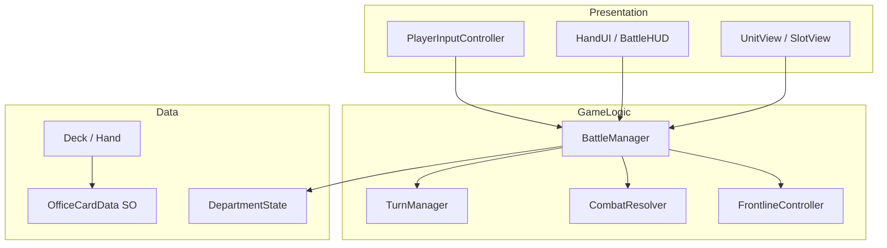

# 🎮 游戏项目独立开发策划书：《疯狂周一：办公室战争》

> **技术栈：** C# + Unity 2022 LTS（或 6000.x）  
> **开发策略：** 先用 Cube / UI 方块跑通全部逻辑，再换美术资源  
> **版本控制：** Git + `.gitignore`（忽略 `Library/`、`Temp/`、`Logs/`）

---

## 一、 项目基本信息

| 项 | 内容 |
|---|---|
| **暂定名** | 《疯狂周一：办公室战争》（Crazy Monday: Office War） |
| **类型** | 2D / 2.5D 单机策略卡牌（CCG / Roguelike 构筑） |
| **致敬标杆** | 《Kards》（空间阵线）、《炉石传说》（资源成长） |
| **美术风格** | 幽默简笔画 / 职场表情包 / 扁平化大厂 UI |
| **目标平台** | PC（Windows / macOS），分辨率 1920×1080 |

---

## 二、 核心世界观与胜负判定

**剧情背景：** 某大厂年终盘点将至，**产品经理部** 与 **研发程序员部** 为争夺唯一 S 级年终奖，在「中央茶水间」展开甩锅、画饼、PPT 轰炸对决。

**战场布局（三行，类似 Kards）：**

```
[ 敌方后方：敌方主管办公室 (HQ) ]     ← 敌方部署区 + HQ 血量
────────────────────────────────
[      中央阵线：老板的视线区      ]     ← 前线，同一时间仅一方占领
────────────────────────────────
[ 己方后方：己方主管办公室 (HQ) ]     ← 己方部署区 + HQ 血量
```

**胜负判定：**
- 各部门 HQ 初始「部门预算」= 20（等同 HQ 血量）
- 将员工推至前线，对敌方 HQ 发起「汇报/甩锅」（攻击）
- 先将对方部门预算削减至 **0** 的一方获胜

---

## 三、 核心战斗机制

### 1. 双重咖啡资源（Coffee System）

| 概念 | 规则 |
|---|---|
| **咖啡上限** | 开局 1，每回合开始 +1（上限 12）；回合开始时当前可用咖啡回满 |
| **入职成本（Hire Cost）** | 打出员工卡到己方后方，一次性扣咖啡 |
| **沟通成本（Action Cost）** | 推进到前线或攻击时，额外扣该员工行动费；咖啡不足则「摸鱼」 |

### 2. 前线争夺（Frontline）

- 前线同一时间只能被一方占领（有单位即占领，双方都有则按规则结算，见下文）
- 己方占领前线时，后方远程单位（Manager）可安全输出
- 敌方占领前线时，己方后方 HQ 可被敌方前线近战直接攻击

### 3. 兵种与 JobType

| JobType | Kards 对应 | 职场设定 | 代码特性 |
|---|---|---|---|
| `Intern` | 步兵 | 实习生、外包 | 部署费低，占线挡枪 |
| `Engineer` | 坦克 | 架构师、全栈 | 血厚攻高，行动费高 |
| `Manager` | 火炮 | PPT 战神 | 在后方攻击时不受反击 |
| `HR` | 支援 | 招聘、行政 | 不可推进，可回血/加攻 |

### 4. 战斗细则（需在代码中明确实现）

```
部署：手牌 → 己方后方空位，扣 Hire Cost
推进：后方单位 → 前线（需空位或替换规则），扣 Action Cost，标记 HasActed
攻击：前线单位 → 相邻敌方单位或 HQ，双方互扣 KPI（Manager 在后方攻击免反击）
死亡：精神值 ≤ 0 → 从战场移除，释放格子
回合结束：重置 HasActed，咖啡回满，切换 ActivePlayer，咖啡上限 +1（若未达 12）
```

**前线冲突（建议 MVP 规则）：** 若双方同时有单位想占前线，先到达者占线；同回合对撞时按 KPI 互扣，存活者占线。

---

## 四、 Unity 工程结构

### 4.1 推荐目录

```
Assets/
├── _Project/
│   ├── Scenes/
│   │   ├── Boot.unity              # 初始化、加载配置
│   │   └── Battle.unity            # 主战斗场景
│   ├── Scripts/
│   │   ├── Core/                   # 枚举、常量、事件总线
│   │   ├── Data/                   # ScriptableObject 定义
│   │   ├── Cards/                  # 卡牌实例、卡组、手牌
│   │   ├── Battlefield/            # 格子、前线、单位实体
│   │   ├── Combat/                 # 伤害、攻击、死亡
│   │   ├── Resources/              # 咖啡、HQ 血量
│   │   ├── Turn/                   # 回合状态机
│   │   ├── Input/                  # 点击、拖拽、选中
│   │   ├── AI/                     # 简单敌方 AI（后期）
│   │   └── UI/                     # 手牌 UI、HUD、按钮
│   ├── ScriptableObjects/
│   │   └── Cards/                  # 各卡牌 .asset 配置
│   ├── Prefabs/
│   │   ├── CardView.prefab
│   │   ├── UnitView.prefab         # 先用 Cube + TextMeshPro
│   │   └── SlotView.prefab         # 格子高亮
│   ├── Art/                        # 后期：贴图、Spine 等
│   └── Audio/
├── Plugins/                        # 第三方（如 DOTween，可选）
└── Settings/                       # URP/Input System 等
```

### 4.2 核心依赖（Package Manager）

| 包 | 用途 |
|---|---|
| **TextMeshPro** | 卡牌名、数值、HQ 血量显示 |
| **Input System**（可选） | 统一鼠标/触控 |
| **Unity UI (uGUI)** | 手牌、按钮、HUD |
| **2D Sprite** 或 **URP** | 2D 正交相机或轻量 3D |

**MVP 阶段不必引入：** Addressables、Netcode、Timeline。

---

## 五、 C# 架构设计

### 5.1 分层关系



**原则：**
- **数据（SO + 运行时 State）** 与 **表现（MonoBehaviour View）** 分离
- `BattleManager` 作为单场战斗的 Facade，不直接在 View 里写扣血逻辑
- 用 **C# event** 或 **ScriptableObject Event Channel** 通知 UI 刷新

### 5.2 核心类型一览

#### 枚举与常量 — `Core/GameEnums.cs`

```csharp
public enum JobType { Intern, Engineer, Manager, HR }
public enum Faction { Player, Enemy }
public enum BoardRow { PlayerBack, Frontline, EnemyBack }
public enum TurnPhase { Draw, Main, End }
public enum GameResult { Ongoing, PlayerWin, EnemyWin }
```

#### 卡牌配置 — `Data/OfficeCardData.cs`（ScriptableObject）✅ 已有概念

```csharp
[CreateAssetMenu(menuName = "OfficeWar/Card")]
public class OfficeCardData : ScriptableObject
{
    public string cardId;
    public string displayName;
    public JobType job;
    public int hireCost;
    public int actionCost;
    public int maxMorale;      // 精神值 / HP
    public int kpi;            // 攻击力
    public Sprite icon;        // 后期
    public bool canAdvance = true;
    public bool isSupport;     // HR 等
}
```

#### 运行时卡牌实例 — `Cards/RuntimeCard.cs`

```csharp
public sealed class RuntimeCard
{
    public OfficeCardData Data { get; }
    public int InstanceId { get; }
    // 与场上 Unit 绑定后由 UnitEntity 持有
}
```

#### 部门状态 — `Resources/DepartmentState.cs`（对应已有 DepartmentManager）

```csharp
public class DepartmentState
{
    public Faction Faction { get; }
    public int HqBudget { get; private set; }      // 初始 20
    public int CoffeeMax { get; private set; }     // 1~12
    public int CoffeeCurrent { get; private set; }

    public bool TrySpendCoffee(int amount);
    public void RefillCoffee();
    public void IncreaseCoffeeMax();               // 每回合开始 +1
    public void TakeHqDamage(int amount);
}
```

#### 战场格子 — `Battlefield/BoardSlot.cs`

```csharp
public class BoardSlot
{
    public BoardRow Row { get; }
    public int ColumnIndex { get; }                 // MVP: 每行 1 格即可，后期可扩展多列
    public Faction? OwnerForFrontline { get; set; } // 仅 Frontline 行使用
    public UnitEntity Occupant { get; set; }
    public bool IsEmpty => Occupant == null;
}
```

#### 单位实体 — `Battlefield/UnitEntity.cs`

```csharp
public class UnitEntity
{
    public RuntimeCard Source { get; }
    public Faction Faction { get; }
    public BoardSlot Slot { get; set; }
    public int CurrentMorale { get; private set; }
    public bool HasActedThisTurn { get; set; }

    public bool CanAct(int availableCoffee) =>
        !HasActedThisTurn && availableCoffee >= Source.Data.actionCost;

    public void TakeDamage(int amount);
    public bool IsDead => CurrentMorale <= 0;
}
```

#### 战斗结算 — `Combat/CombatResolver.cs`

```csharp
public static class CombatResolver
{
    // 单位互殴：双方同时扣 KPI
    public static void ResolveUnitVsUnit(UnitEntity attacker, UnitEntity defender);

    // 攻击 HQ：仅扣敌方预算
    public static void ResolveUnitVsHq(UnitEntity attacker, DepartmentState targetHq);

    // Manager 在后方攻击：defender 不反击
    public static void ResolveRangedAttack(UnitEntity attacker, UnitEntity defender, bool attackerInBackRow);
}
```

#### 回合管理 — `Turn/TurnManager.cs`

```csharp
public class TurnManager : MonoBehaviour
{
    public Faction ActiveFaction { get; private set; }
    public TurnPhase Phase { get; private set; }
    public int TurnNumber { get; private set; }

    public event Action<Faction> OnTurnStarted;
    public event Action<Faction> OnTurnEnded;

    public void StartBattle();
    public void EndTurn();  // 玩家点「结束回合」或 AI 完成
}
```

#### 战斗总控 — `Battle/BattleManager.cs`

```csharp
public class BattleManager : MonoBehaviour
{
    // 组合：TurnManager, FrontlineController, Hand, Deck, 双方 DepartmentState
    public GameResult Result { get; private set; }

    public bool TryPlayCardFromHand(RuntimeCard card, BoardSlot targetSlot);
    public bool TryAdvanceUnit(UnitEntity unit);
    public bool TryAttack(UnitEntity attacker, IAttackTarget target);
    public void EndPlayerTurn();
}
```

---

## 六、 场景与 Prefab 搭建（MVP）

### 6.1 Battle 场景层级

```
Battle (Scene)
├── Main Camera (Orthographic)
├── BattleManager          [BattleManager, TurnManager]
├── Board
│   ├── Row_PlayerBack     → SlotView × 1（或 3）
│   ├── Row_Frontline      → SlotView × 1
│   └── Row_EnemyBack      → SlotView × 1
├── Units                  （运行时 Instantiate UnitView）
├── UI
│   ├── Canvas
│   │   ├── HUD_Coffee
│   │   ├── HUD_HQ_Player / HUD_HQ_Enemy
│   │   ├── HandPanel
│   │   └── Btn_EndTurn
└── EventSystem
```

### 6.2 UnitView（占位美术）

- `Cube` 或 `UI Image` + `TextMeshPro` 显示：`名称 | 精神值 | KPI`
- 颜色区分 Faction：Player = 蓝，Enemy = 红
- JobType 用子物体小图标或字母 I/E/M/H

### 6.3 输入流程（MVP 用点击，不用拖拽）

1. 点击手牌 → 进入「部署模式」，高亮可放置的己方后方格
2. 点击空格 → `BattleManager.TryPlayCardFromHand`
3. 点击己方单位 → 进入「行动模式」，显示可推进 / 可攻击目标
4. 点击目标格或敌方单位 → 执行推进或攻击
5. 点击「结束回合」→ `EndPlayerTurn`

---

## 七、 分阶段开发路线图（详细）

### 阶段 0：工程初始化（0.5~1 天）

- [ ] 创建 Unity 项目（2D 或 3D 均可，相机正交）
- [ ] 建立 `_Project` 目录结构
- [ ] 配置 Git，添加 Unity `.gitignore`
- [ ] 创建 `Boot`、`Battle` 场景
- [ ] 定义 `GameEnums.cs`、常量类 `GameConstants.cs`（HQ=20, MaxCoffee=12, OpeningHand=3）

**验收：** 空场景能 Play，Console 无报错。

---

### 阶段 1：数据与资源池（1~2 天）— 部分已完成

- [x] `OfficeCardData` ScriptableObject
- [x] `DepartmentManager` / `DepartmentState`：咖啡扣费、HQ 血量
- [ ] 在 `ScriptableObjects/Cards/` 创建 **8~12 张测试卡**：
  - 实习生 ×2（1费/2费）
  - 研发 ×2（3费厚血、4费高攻）
  - 管理 ×2（后方远程）
  - HR ×1（治疗或 Buff）
- [ ] 编写 **Editor 菜单** 或简单 Inspector 按钮：`Reset HQ`、`Spend Coffee` 测试

**验收：** 在 Inspector 中改 SO 数值，运行时代码能正确读取；咖啡不足时 `TrySpendCoffee` 返回 false。

---

### 阶段 2：卡组、手牌与 UI（2~3 天）

- [ ] `Deck`：20 张 RuntimeCard 列表，洗牌 `Shuffle()`
- [ ] `Hand`：抽牌 `Draw(n)`，上限 10（可配置）
- [ ] 战斗开始：`Draw(3)`，双方各初始化 Deck（MVP 可用同一套牌）
- [ ] `HandUI`：动态生成 `CardView`，显示名称、Hire Cost、Job 图标
- [ ] `BattleHUD`：咖啡 `当前/上限`、HQ 预算、回合数、当前行动方
- [ ] 点击手牌 → 回调 `BattleManager`（先只 Log，暂不部署）

**验收：** 开局手牌 3 张，UI 与数据同步；抽牌后手牌数量正确。

---

### 阶段 3：部署单位到后方（2~3 天）

- [ ] `BoardSlot` + `BoardController`：初始化三行格子
- [ ] `SlotView`：空闲/占用/高亮材质或颜色
- [ ] `UnitFactory`：根据 `OfficeCardData` 创建 `UnitEntity` + `UnitView`
- [ ] `TryPlayCardFromHand`：
  1. 验证：己方回合、Main 阶段、后方格空、咖啡足够
  2. 扣 Hire Cost，实例化单位，手牌移除
- [ ] 部署失败时 Toast 或 Log 原因（咖啡不足、格子已满）

**验收：** 点击手牌再点后方格，Cube 出现，咖啡减少，HQ 不变。

---

### 阶段 4：前线与移动（3~4 天）— 核心难点

- [ ] `FrontlineController`：
  - `GetOwner()` → Player / Enemy / None
  - `UpdateOwner()`：根据 Frontline 格上单位 Faction 更新
- [ ] `TryAdvanceUnit`：
  1. 单位在 PlayerBack / EnemyBack
  2. 未行动、咖啡够 Action Cost
  3. 前线规则：Frontline 无敌方单位或按设计允许替换
  4. 移动 `Slot` 引用，更新 Frontline 归属
- [ ] 行动后 `HasActedThisTurn = true`
- [ ] HR：`canAdvance = false`，点击只触发技能（阶段 6）

**验收：** 实习生推到前线，Frontline 显示为己方；咖啡扣 Action Cost。

---

### 阶段 5：战斗与 HQ 攻击（3~4 天）

- [ ] `CombatResolver.ResolveUnitVsUnit`：双向伤害，死亡 `RemoveUnit`
- [ ] 攻击 HQ 条件（MVP）：
  - 攻击方在前线 **或** Manager 在后方且己方占领前线
  - 目标为敌方 HQ
- [ ] `Manager` 后方攻击：不触发反击
- [ ] `GameResult`：HQ ≤ 0 时结束，弹出胜负 UI
- [ ] 单位死亡：Destroy View，清空 Slot，刷新 Frontline

**验收：** 前线单位互殴双死；将敌方 HQ 打到 0 弹出「你拿到了年终奖」。

---

### 阶段 6：回合流转与 HR 技能（2~3 天）

- [ ] `TurnManager.EndTurn`：
  1. 重置双方所有单位 `HasActedThisTurn`
  2. 下一方 `CoffeeMax++`（≤12），`RefillCoffee`
  3. 切换 `ActiveFaction`，`TurnNumber++`
  4. 可选：回合开始抽 1 张牌
- [ ] 「结束回合」按钮仅己方回合可点
- [ ] HR 卡：部署后点击友军 → 恢复精神值或 +KPI（本回合一次）

**验收：** 多回合循环，咖啡上限递增，双方交替行动。

---

### 阶段 7：敌方 AI（2~4 天）

- [ ] `SimpleEnemyAI`：Coroutine 或状态机，敌方回合自动：
  1. 若后方空且有牌且咖啡够 → 部署最低费单位
  2. 若可推进 → 推进 Intern/Engineer
  3. 若可攻击 → 攻击最低血敌人或 HQ
  4. 调用 `EndTurn`
- [ ] AI 行动间隔 0.5s，便于观察

**验收：** 单人可完整打完一局 PvE。

---

### 阶段 8：打磨与扩展（持续）

- [ ] 音效：部署、攻击、胜利/失败
- [ ] 卡牌 SO 扩到 30+，构筑界面（选 20 张进 Deck）
- [ ] Roguelike 地图节点（后期）
- [ ] 真 2D 立绘替换 Cube
- [ ] 存档：Statistics、解锁卡牌

---

## 八、 模块依赖顺序（开发顺序强制建议）

```
GameEnums / Constants
    ↓
OfficeCardData (SO) + 测试卡资产
    ↓
DepartmentState
    ↓
Deck / Hand / RuntimeCard
    ↓
BoardSlot / UnitEntity / BoardController
    ↓
BattleManager（部署）
    ↓
FrontlineController + TryAdvanceUnit
    ↓
CombatResolver + HQ 胜负
    ↓
TurnManager + EndTurn
    ↓
HandUI / BattleHUD / Input
    ↓
SimpleEnemyAI
```

**不要并行写** Combat 与 Turn 的完整逻辑后再接 Board，容易返工。

---

## 九、 关键代码片段参考

### 9.1 部署校验（BattleManager）

```csharp
public bool TryPlayCardFromHand(RuntimeCard card, BoardSlot slot)
{
    if (Result != GameResult.Ongoing) return false;
    if (turnManager.ActiveFaction != Faction.Player) return false;
    if (slot.Row != BoardRow.PlayerBack || !slot.IsEmpty) return false;

    var dept = playerDepartment;
    if (!dept.TrySpendCoffee(card.Data.hireCost)) return false;

    var unit = unitFactory.Spawn(card, Faction.Player, slot);
    hand.Remove(card);
    OnBoardChanged?.Invoke();
    return true;
}
```

### 9.2 回合开始

```csharp
void StartTurn(Faction faction)
{
    var dept = GetDepartment(faction);
    if (turnNumber > 1 || faction == Faction.Player)
        dept.IncreaseCoffeeMax();
    dept.RefillCoffee();
    ResetAllUnitsActedFlag(faction);
    OnTurnStarted?.Invoke(faction);
}
```

### 9.3 互殴伤害

```csharp
public static void ResolveUnitVsUnit(UnitEntity a, UnitEntity b)
{
    b.TakeDamage(a.Source.Data.kpi);
    a.TakeDamage(b.Source.Data.kpi);
}
```

---

## 十、 测试检查清单

| # | 用例 | 预期 |
|---|---|---|
| 1 | 咖啡 0 时打出 1 费卡 | 失败，单位不出现 |
| 2 | 后方已满再部署 | 失败 |
| 3 | 推进后 Action Cost 不足再攻击 | 摸鱼，不执行 |
| 4 | Manager 后方打前线敌人 | 敌人扣血，Manager 不扣 |
| 5 | 双方前线单位对撞 | 双扣血，死者移除 |
| 6 | HQ 降至 0 | 战斗结束，不可再操作 |
| 7 | 结束回合 | 咖啡回满，上限 +1，换边 |
| 8 | 第 12 回合后 | 咖啡上限不再增加 |

建议在 `Assets/_Project/Tests/` 用 **Unity Test Framework** 为 `DepartmentState`、`CombatResolver`、`Deck` 写 EditMode 单元测试。

---

## 十一、 当前进度与下一步

| 模块 | 状态 | 下一步 |
|---|---|---|
| 数据与资源池 | 🟡 部分完成 | 补全测试用 SO 资产 + DepartmentState 单元测试 |
| 手牌与战场交互 | ⚪ 未开始 | 实现 Deck/Hand + HandUI |
| 阵线与移动 | ⚪ 未开始 | BoardController + FrontlineController |
| 战斗与回合 | ⚪ 未开始 | CombatResolver + TurnManager |

**建议本周目标（Week 1）：** 完成阶段 0~2，在 Battle 场景中看到 3 张手牌、咖啡与 HQ UI，并能 Log 模拟部署。

---

## 💡 策划寄语

先用 **Cube + TextMeshPro** 跑通「扣咖啡 → 部署 → 推线 → 互殴 → 扣 HQ → 换回合」。当你看到「PPT 战神」Cube 扣除 3 点咖啡并打碎「外包老哥」时，核心玩法就成立了；美术与 Roguelike 层可以之后再叠。
